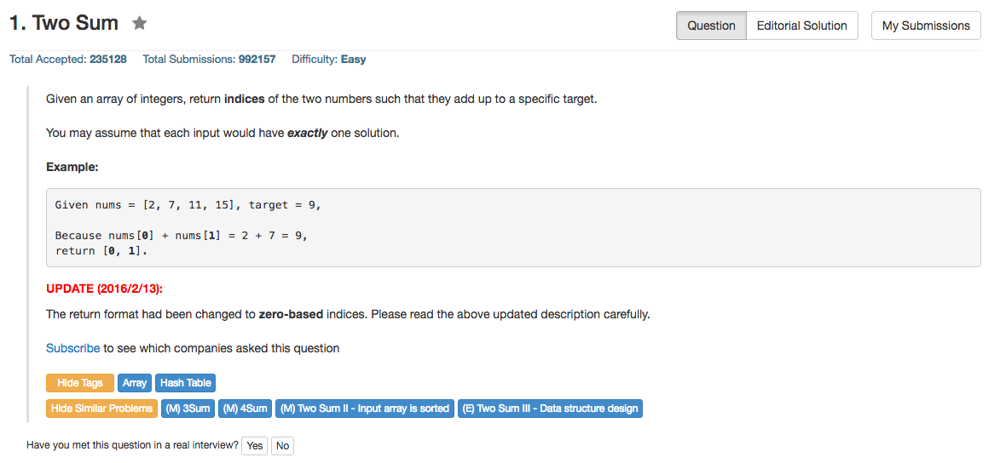

## Algorithm 

1. O(n^2)的算法，对于每一个数值，刷一遍后面的数，看看是否存在加起来等于结果的。
2. 用Hash Table，每次读入一个值，就把(target - x)这个值和它的位置存到hash表里面，然后对于每一个新值都先check一遍hash表里面有没有，如果存在，就找到了，如果不存在，就加入(target-x)。这个意外的很快啊，如果认为系统实现Hash Table是O(1)的话，这个就是O(N)的算法了
3. O(NlogN)的算法：排序+二分，先用快速排序一遍，然后对每一个值，进行二分查找是否存在对应的值存在，如果找到了就得到了问题的解，之后只需要把原始index找到就好了

## Code

####C/C++

####python

####ruby
```ruby
# @param {Integer[]} nums
# @param {Integer} target
# @return {Integer[]}
#Hash
def two_sum(nums, target)
    hash = {};
    index1 = 0;
    index2 = 0;
    nums.each_with_index do |x, ind|
        if hash.include?(x)
            index1 = hash[x]
            index2 = ind + 1
            break
        else
            hash[(target-x)] = ind + 1
        end
    end
    return [index1, index2]
end
```

```ruby
#Sort + Binary
def two_sum(nums, target)
    index1 = 0;
    index2 = 0;
    ans1 = nil;
    ans2 = nil;
    nums2 = nums.sort #Don't know what algorithm has been used in standard library.
    nums2.each do |x|
        left = 0
        right = nums2.length - 1
        #binary search
        while left <= right do
            mid = (left + right) / 2
            mid_value = nums2[mid]
            if mid_value === (target - x)
                ans1 = x
                ans2 = mid_value
                break
            elsif mid_value > (target - x)
                right = mid - 1
            else
                left = mid + 1
            end
        end        
        #exit loop if answers are gotten
        break if !ans1.nil?    
    end
    nums.each_with_index do |x, ind|
        puts [x, ind]
        if x === ans1
            $ind1 = ind + 1 #if first set in the block, the variable is local, or, use $ to indicate it is global variable
            ans1 = nil
        elsif x === ans2
            $ind2 = ind + 1
            ans2 = nil
        end
    end
    index1 = [$ind1, $ind2].min
    index2 = [$ind1, $ind2].max
    return [index1, index2]
end
```