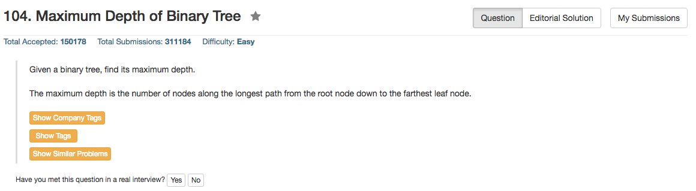

## Algorithm 

- 非常简单粗暴地树结构的问题。
- 如果root == [], 那深度就是0；否则就是max(左孩子深度, 右孩子深度)+1

## Comment

- C不自带max函数，所以没法一行搞定；但是C++默认自带max函数，所以就可以一行搞定了。
- 基本上都是一行的程序。
- Ruby和Python不需要操作指针，所以基本上可以看做是静态数组来实现。
- 同样是一行的程序，C++只需要8ms，但是Python和Ruby需要将近100ms。

## Code

```C++
class Solution {
public:
    int maxDepth(TreeNode* root) {
        return root ? max(maxDepth(root->left), maxDepth(root->right)) + 1 : 0;
    }
};
```
<hr>
```Python
class Solution:
    # @param {TreeNode} root
    # @return {integer}
    def maxDepth(self, root):
        if root != None:
            return 1 + max(self.maxDepth(root.left),self.maxDepth(root.right))
        else:
            return 0
```
<hr>
```Ruby
# Definition for a binary tree node.
# class TreeNode
#     attr_accessor :val, :left, :right
#     def initialize(val)
#         @val = val
#         @left, @right = nil, nil
#     end
# end

# @param {TreeNode} root
# @return {Integer}
def max_depth(root)
    return !root.nil? ? 1 + [max_depth(root.left),max_depth(root.right)].max : 0
end
```
