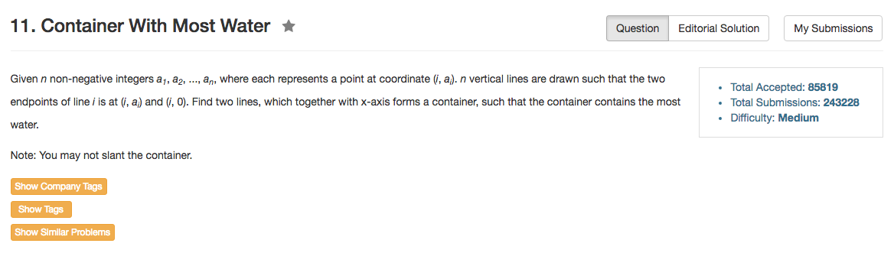

## Algorithm 

- 这个题目其实还蛮有意思的
    - 最初的想法是一开始就选最两端的两根，因为横向距离最长。
    - 但是有可能中间有些情况，虽然横向距离不长，但是高度很高，结果最后总面积更大
    - 所以思路如下：
        1. 从两边往中间收拢
        2. 如果`height[left] < height[right]`，我们就把左边右移一个，看看能不能得到一个更高的棍子。
        3. 如果`height[left] > height[right]`，我们就把右边左移一个，看看能不能得到一个更高的棍子。
        4. 每一次更新就看当前最大值是不是更大。
- [这里](https://discuss.leetcode.com/topic/16754/simple-and-fast-c-c-with-explanation)加速了一下这个过程。

## Comment

- 这道题目的解法还蛮巧妙地！

## Code


```C++
class Solution {
public:
    int maxArea(vector<int>& height) {
        int maxValue = 0, i = 0, j = height.size() - 1;
        while (i < j){
            maxValue = max(maxValue, min(height[i], height[j]) * (j - i));
            if (height[i] > height[j]){
                j--;
            } else {
                i++;
            }
        }
        return maxValue;
    }
};
```