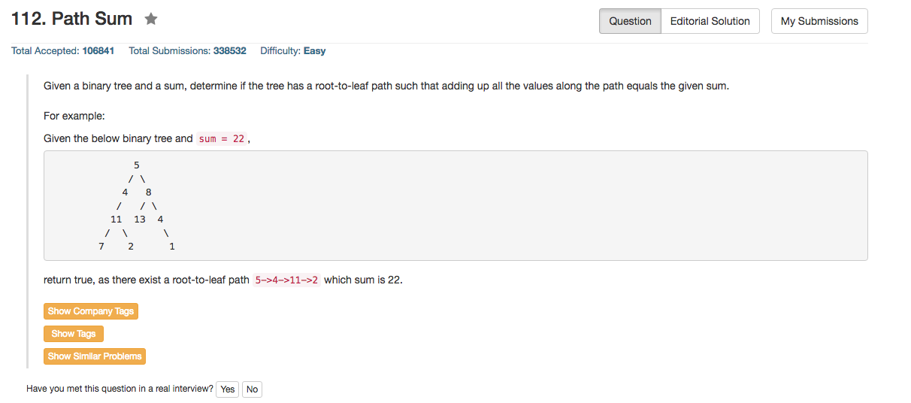

## Algorithm 

- 二叉树递归处理咯

## Comment

- 要注意的是如果是空树，那么不管`sum`是多少，都是`false`
- 这里就涉及到code要怎么组织才能使最精简的了，重要的还是写出漂亮的代码。

## Code

```c++
/**
 * Definition for a binary tree node.
 * struct TreeNode {
 *     int val;
 *     TreeNode *left;
 *     TreeNode *right;
 *     TreeNode(int x) : val(x), left(NULL), right(NULL) {}
 * };
 */
class Solution {
public:
    bool hasPathSum(TreeNode* root, int sum) {
        if (root == NULL) return false;
        if (root->left == NULL && root->right == NULL && root->val == sum) return true;
        return hasPathSum(root->left, sum - root->val) || hasPathSum(root->right, sum - root->val);
    }
};
```