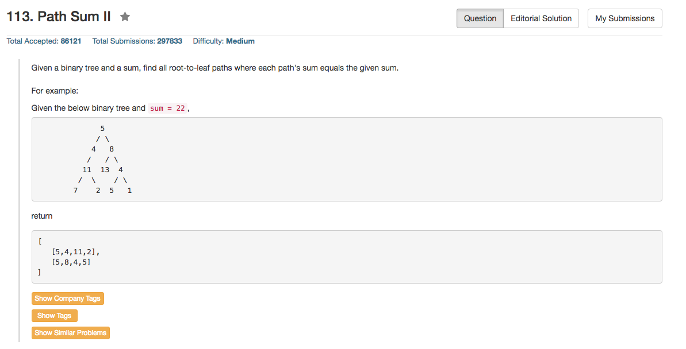

## Algorithm 

- 就是比较简单的深搜/回溯，基本上是遍历一遍整个树，然后发现到叶子结点的时候整个path的和达到了要求就push到最终答案里面去就可以了。

## Comment

- 边界条件要注意，写了好几次。
- 一个是root是否为NULL
- 一个是什么时候把当前的root-val加入path
- 一个是怎么判断path的和到了规定的目标

## Code

```C++
class Solution {
public:
    vector<vector<int>> pathSum(TreeNode* root, int sum) {
        travel(root, sum);
        return ans;
    }
private:
    vector<vector<int>> ans;
    vector<int> path;
    void travel(TreeNode* root, int sum){
        if (root) {
            path.push_back(root->val);
            if (root->left == NULL && root->right == NULL && sum == root->val){
                ans.push_back(path);
            } else {
                if (root->left) travel(root->left, sum - root->val);
                if (root->right) travel(root->right, sum - root->val);                
            }
            path.pop_back();
        }
    }
};
```

