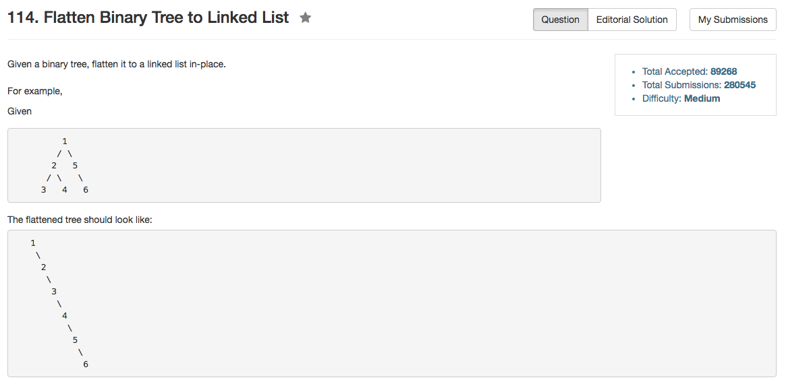

## Algorithm 

- 这道题目比较好想的是用递归的方法：
    1. 先flatten右子树
    2. 如果左子树不为空，再flatten左子树
    3. 然后把`root`的右子树接上flatten的左子树，并清空左子树；最后接上flatten的右子树。
- 但是这道题目也有很不错的非递归写法，比如一个解法来自[这里](https://discuss.leetcode.com/topic/3995/share-my-simple-non-recursive-solution-o-1-space-complexity)，基本思路就是：
    1. 如果当前结点有左子树，那么就把当前结点的右子树放到左子树最右边的最下面，然后把左子树放到当前结点的右子树。
    2. 上一步结束之后，当前结点左边为空，右边为把左右子树已经串联好了
    3. 然后直接走一步到右子树，继续进行上一个操作。


## Comment

- 基本的二叉树问题思路都会差不多。
- 但是非递归的方法值得学习

## Code

```C++
class Solution {
public:
    void flatten(TreeNode* root) {
        if (!root) return;
        if (root->right) flatten(root->right);
        TreeNode* rightSub = root->right;
        if (root->left) {
            flatten(root->left);
            TreeNode* leftSub = root->left; 
            while (leftSub->right != NULL) leftSub = leftSub->right;
            root->right = root->left;
            root->left = NULL;
            leftSub->right = rightSub;
        }
    }
};
```

来自[这里](https://discuss.leetcode.com/topic/11444/my-short-post-order-traversal-java-solution-for-share)的Java程序把上面的程序写个更加精练了，尤其是那个`prev`的用法

```Java
private TreeNode prev = null;

public void flatten(TreeNode root) {
    if (root == null)
        return;
    flatten(root.right);
    flatten(root.left);
    root.right = prev;
    root.left = null;
    prev = root;
}
```

来自[这里](https://discuss.leetcode.com/topic/3995/share-my-simple-non-recursive-solution-o-1-space-complexity)的非递归C++程序

```C++
class Solution {
public:
    void flatten(TreeNode *root) {
        TreeNode*now = root;
        while (now)
        {
            if(now->left)
            {
                //Find current node's prenode that links to current node's right subtree
                TreeNode* pre = now->left;
                while(pre->right)
                {
                    pre = pre->right;
                }
                pre->right = now->right;
                //Use current node's left subtree to replace its right subtree(original right 
                //subtree is already linked by current node's prenode
                now->right = now->left;
                now->left = NULL;
            }
            now = now->right;
        }
    }
};
```