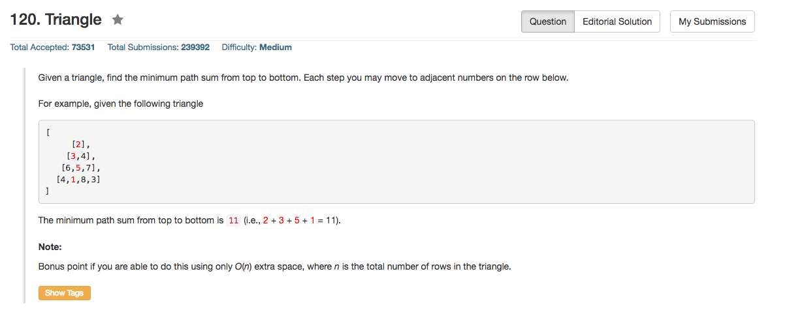

## Algorithm 

- 这道题目就是非常基础的动态规划
- `F[i][j]`为从最顶上到`(i, j)`这个位置的最短距离，显然`F[i][j] = min(F[i-1][j], F[i-1][j-1]) + A[i][j]`
- 唯一要注意的是边界条件
    1. 每行第一个，只能是`F[i][0] = F[i-1][0] + A[i][j]`
    2. 每行最后一个，只能是`F[i][m-1] = F[i-1][m-2] + A[i][j]`
- 至于如果只用O(n)的额外空间，思路就是滚动数组
    - 因为第`i`行的结果只跟`i-1`行有关，所以只需要有两个长度为n的数组，然后滚动就好了: `a1`表示第`i-1`行的结果, `a2`第`i`行的结果。一次迭代之后，`a2 = a1`，然后再继续更新好了。
    - 具体的实现的话，可以用数组也可以用两个pointer
- 最后，这个DP有两种实现方式：从上至下或者从下至上。我的实现方式是从上至下。[这里](https://leetcode.com/discuss/20296/bottom-up-5-line-c-solution)有一个从下至上写的非常漂亮的解。以及，[这里](https://leetcode.com/discuss/5337/dp-solution-for-triangle)有关于这两种解的讨论。

## Comment

- 老实说我就是直接在原始数组上修改了，所以也没有用额外的空间，虽然严格意义上来说这样做是用了O(n^2)的额外空间。

## Code

```C++
class Solution {
public:
    int minimumTotal(vector<vector<int>>& triangle) {
        int n = triangle.size();
        int n_last = triangle[n - 1].size();
        for (int i = 1; i < n; i++){
            int m = triangle[i].size();
            triangle[i][0] = triangle[i][0] + triangle[i-1][0];
            triangle[i][m - 1] = triangle[i][m - 1] + triangle[i - 1][m - 2];
            for (int j = 1; j < m - 1; j++){
                triangle[i][j] = triangle[i][j] + min(triangle[i - 1][j - 1], triangle[i - 1][j]);
            }
        }
        int minAns = triangle[n - 1][0];
        for (int i = 1; i < n_last; i++){
            minAns = min(triangle[n - 1][i], minAns);
        }
        return minAns;
    }
};
```

[这里](https://leetcode.com/discuss/20296/bottom-up-5-line-c-solution)的从下至上的解。

```c++
class Solution {
public:
    int minimumTotal(vector<vector<int> > &triangle) 
    {
        vector<int> mini = triangle[triangle.size()-1];
        for ( int i = triangle.size() - 2; i>= 0 ; --i )
            for ( int j = 0; j < triangle[i].size() ; ++ j )
                mini[j] = triangle[i][j] + min(mini[j],mini[j+1]);
        return mini[0];
    }
};
```