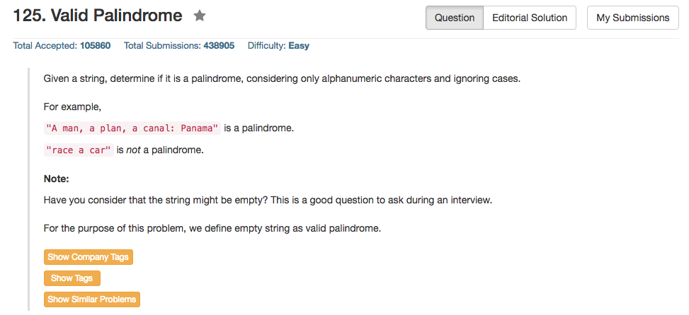

## Algorithm 

- 这个题目基本上没有什么算法好说，重要的还是在字符串的判断
- 首先一个是要判断一个字符是不是alphabet-numeric字符，然后要判断合法的字符是否在控制大小写之后依然相同。
- 上面这个问题，如果不借助其他的默认函数，可以用regex或者hash表在做。
- 但是很多语言有很多默认函数帮助完成上面的最重要的判断，这一点也是我们需要熟悉语言的。

## Comment

- **注意：**这个问题有很多边界条件要问面试官，比如空串是否被定义为回文串，比如只有非法符号的串是否被定义为回文串等等。
- 每一个语言对应的数据结构的默认操作还是要熟悉。
- C++里面有`isalnum()`返回一个`int`值来判断是否是alphabet-numeric字符，另外还有`toupper()`和`tolower()`两个函数来转换字符大小写。
- 我的程序没有使用这些默认函数，所以写的很糟糕。


## Code

我使用hash map来控制判断一个字符是否是alphabet-numeric character的，另外，由于要处理大小写的问题，我把字符map到了0到26，而把数字map到了-10到-1；这并不是什么很优美的算法，在借助其他的默认函数的情况下，这个是一种直接的办法。

```c++
class Solution {
public:
    bool isPalindrome(string s) {
       int left = 0, right = s.size() - 1;
       std::unordered_map<char, char> charSet;
       for (char c = 'a'; c <= 'z'; c++) charSet[c] = 'a';
       for (char c = 'A'; c <= 'Z'; c++) charSet[c] = 'A';
       for (char c = '0'; c <= '9'; c++) charSet[c] = '0' + 10;
       while (left < right){
           if (charSet.find(s[left]) == charSet.end()) 
                left ++;
            else if (charSet.find(s[right]) == charSet.end())
                right --;
            else if (s[left] - charSet[s[left]] != s[right] - charSet[s[right]])
                return false;
            else 
                left++, right--;
       }
       return true;
    }
};
```

用C++语言中默认的函数可以大量简化操作，比如`isalphnum()`和`tolower()`，程序来自[这里](https://leetcode.com/discuss/17398/heres-a-clean-c-solution)。但是这里要注意`isalnum()`返回的是`int`类型。

```c++
bool isPalindrome(string s) {
    for (int i = 0, j = s.size() - 1; i < j; i++, j--) { 
        while (isalnum(s[i]) == false && i < j) i++; 
        while (isalnum(s[j]) == false && i < j) j--; 
        if (toupper(s[i]) != toupper(s[j])) return false;
    }

    return true;
}
```