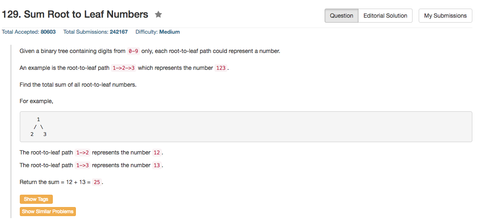

## Algorithm 

- 这个题目没什么好说的，就是DFS，然后到了叶子结点更新一下总和。
- 我是用的全局变量，当然也可以写另外一个函数来返回结果。[这里](https://discuss.leetcode.com/topic/31063/super-simple-dfs-solution)的解就不错，虽然使用Java写的，但是跟C++基本没什么区别。

## Comment

- 可以用stack写一个非递归版本。

## Code

```C++
class Solution {
public:
    int sumNumbers(TreeNode* root) {
        if (root) {
            pathSum = pathSum * 10 + root->val;
            if (root->left == NULL & root->right == NULL){
                allSum = allSum + pathSum;
            } else {
                sumNumbers(root->left);
                sumNumbers(root->right);
            }
            pathSum = pathSum / 10;
        }
        return allSum;
    }
private:
    int allSum = 0, pathSum = 0;
};
```

