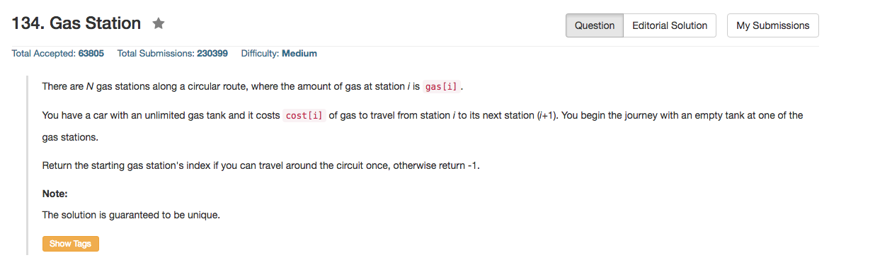

## Algorithm 

- 这个题目意外地有很多种解法。
- 首先是我的解法：
    1. 设置两个指针:`fast`和`slow`
    2. `fast`就一直往前走，每次走一步, `sum += gas[fast] - cost[fast]`。一直走，走到位置`k`如果`sum < 0`的时候，`fast`是从`slow`出发第一个达不到的地方。
    3. 如果`k`不是`slow`自己，也就是说这一圈没有走完，那么`slow`往前走，`sum -= gas[slow] - cost[slow]`，也就是说不断地计算从新的`slow`点出发能不能到达`fast`。
    4. 一旦当前的`sum >= 0`，`fast`就开始往前走，跳转到2. 直到`fast == slow`或者`slow == gas.size()`。前一种情况，我们找到了起点；后一种情况，我们找不到解，返回-1
- 然后讨论里面有很多，[这里](https://leetcode.com/discuss/25341/fully-commented-solution-enabled-single-observation-mine)说的很明白：
    - 如果从`i`到`x`,`x`是第一个不能到达的地方，那么从任意`k = i, i+1, ... x-1`出发，都无法到达`x`。
    - 证明：如果存在`k`可以到达`x`，那么因为`i`可以到达`k`，所以`i`可以先到`k`，然后到`x`，与前提冲突。反证完毕。
    - 这样的话，一旦`fast`找到不能达到的`x`，那么`slow`就可以跳转到`x`继续找了。因为解不可能是`slow`到`x-1`之间的任意一个点。
- 当然，还有[这里](https://leetcode.com/discuss/29413/11ms-c-solution-visiting-each-station-once)的解法，也是非常有意思。
    1. 一个`fast`一直往前走，走到不能走为止
    2. 一个`slow`一直往后走，走到不能走为止
    3. 如果`slow`和`fast`相遇，那么相遇点就是解；否则，这个题就没有解。

## Comment

- 这道题目是一道好题目，有很多种解法，需要思考，但是又不是很难。

## Code

```C++
class Solution {
public:
    int canCompleteCircuit(vector<int>& gas, vector<int>& cost) {
        int sum = 0;
        int fast = 0, slow = 0;
        while (slow < gas.size() ){
            while (sum >= 0){
                sum = sum + gas[fast] - cost[fast];
                fast = (fast + 1) % gas.size();
                if (fast == slow && sum >= 0) return slow;
            }
            sum = sum - gas[slow] + cost[slow];
            slow = slow + 1;
        }
        return -1;
    }
};
```
