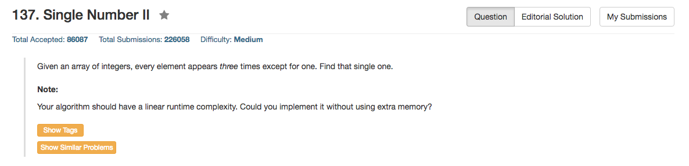

## Algorithm 

- 这是个非常好的题目，[讨论一](https://leetcode.com/discuss/6632/challenge-me-thx)和[讨论二](https://leetcode.com/discuss/31595/detailed-explanation-generalization-bitwise-operation-numbers)对这个题目有很深入的分析和扩展，值得好好学习
- 基本的思路是分析每一个bit，由于每一个_非特别_的数都会出现三次，所以这个数在某一个bit上会贡献3个0或者3个1，所以这个bit最后的sum对于3的余数，就是那个_特别_的数贡献的。根据这个思路，我们就想知道每一个bit上出现的0和1的sum对3的余数是多少。
    1. 当然，直接的方法是可以存一个32维的数组，然后对于每一个数字，一位一位地分解、加和。这样比较简洁易懂，但是空间上就浪费的比较多，程序见[这里](https://leetcode.com/discuss/56524/a-general-c-solution-for-these-type-problems)
    2. 另外就是用boolean operation，这里就有很tricky的方法来实现。

## Comment

- 这道题目的逻辑/布尔运算是真的很厉害，而且还具有拓展性，值得认真学习。 

## Code


```c++
class Solution {
public:
    int singleNumber(vector<int>& nums) {
        int ones = 0, twos = 0;
        for(int i = 0; i < nums.size(); i++){
            ones = (ones ^ nums[i]) & ~twos;
            twos = (twos ^ nums[i]) & ~ones;
        }
        return ones;
    }
};
```