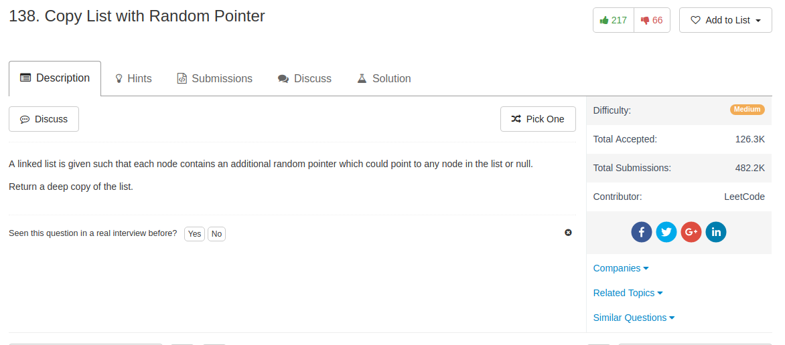

## Algorithm

- 这个题目最容易想的方法是对每一个原始node，Hash一下它对应的node。一个问题是，Class/Object到底能不能被Hash
- Python里面似乎是可以Hash的，解法见下面的解
- 但是还是得想一个不用Hash的办法，因为不确定所有的语言都可以这么风骚地Hash一个Class/Object。这个方法有点厉害，来自[这里](https://discuss.leetcode.com/topic/7594/a-solution-with-constant-space-complexity-o-1-and-linear-time-complexity-o-n/2)
  - 1）在原始list的中间穿插new_node，这样组成一个[old_1 - new_1 - old_2 - new_2 -...]的single list
  - 2）然后用这个single list把random的那个链接关系map出来: `new.random = old.random.next`
  - 3) 再把这两个old/new的list剥离开来

## Comment

- dict有时候还挺强大的。只要是hashable的东西，都可以用dict。但是理论上来说，这个object没有建立`__hash__`和`__eq__`两个函数，不知道为什么也可以直接用到`dict`里面去

## Code

不用Hash的解，仿照上面的思路写的

```python
class Solution(object):
    def copyRandomList(self, head):
        """
        :type head: RandomListNode
        :rtype: RandomListNode
        """
        p = head
        while p: # create the old-new-old-new single list
            node = RandomListNode(p.label)
            node.next = p.next
            p.next = node
            p = node.next
        p = head
        while p: # create the random link
            if p.random is not None:
                p.next.random = p.random.next
            p = p.next.next
        dummy = RandomListNode(0)
        p, q = head, dummy
        while p: # extract two lists
            q.next = p.next
            p.next = p.next.next
            p, q = p.next, q.next
        return dummy.next
```

这是[网上的用Hash的解](https://discuss.leetcode.com/topic/9557/clear-and-short-python-o-2n-and-o-n-solution)，第一个是同普通的`dict`，第二个是用`defaultdict`，都挺厉害的。

```python
# just use dict
class Solution:
# @param head, a RandomListNode
# @return a RandomListNode
def copyRandomList(self, head):
    dic = dict()
    m = n = head
    while m:
        dic[m] = RandomListNode(m.label)
        m = m.next
    while n:
        dic[n].next = dic.get(n.next)
        dic[n].random = dic.get(n.random)
        n = n.next
    return dic.get(head)
```

```python
# use defaultdict
class Solution:
# @param head, a RandomListNode
# @return a RandomListNode
def copyRandomList(self, head):
    dic = collections.defaultdict(lambda: RandomListNode(0))
    dic[None] = None
    n = head
    while n:
        dic[n].label = n.label
        dic[n].next = dic[n.next]
        dic[n].random = dic[n.random]
        n = n.next
    return dic[head]
```
