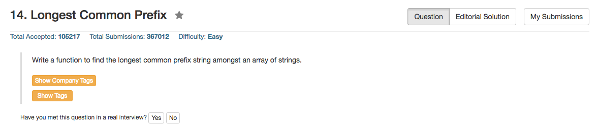

## Algorithm 

- 这个题目一开始想有点复杂，后来发现最好的算法还是直接用最暴力的算法。
- 但是这个暴力的算法的实现方法有两种，这两种方法的并不是一样优秀的，[这里](https://leetcode.com/discuss/15755/optimal-solution)的讨论充分地说明了这个问题。
    1. Horizontal Comparison：就是以第一个串为基准，然后看之后的串跟第一个串有多长的匹配
    2. Vertical Comparison：就是从小到大看所有串的第i个是不是一样，如果某一个位置`i`，存在某一个串的字符跟剩下的不一样，那么最长公共前缀就是`i-1`这个位置了。

## Comment

- 这个题目充分说明了，同样一个算法，不同的实现方式，会有不同的速度和结果。


## Code

我自己写的，horizontal comparison，其实不是最优的。

```c++
class Solution {
public:
    string longestCommonPrefix(vector<string>& strs) {
        if (strs.size() == 0) return "";
        int length = strs[0].size(), i = 1, j = 0;
        while (i < strs.size()){
            j = 0;
            while (j < length && j < strs[i].length()){
                if (strs[i][j] != strs[0][j]){
                    length = j;
                    break;
                }
                j++;
            }
            length = min(length, j);
            i++;
        }
        return strs[0].substr(0,length);
    }
};
```

以下的C++代码来自[这里]()，我觉得写得非常好，使用的是vertical comparsion，效果的确是比horizontal comparison好。

```c++
class Solution {
public:
    string longestCommonPrefix(vector<string>& strs) {
        string prefix = "";
        for(int idx=0; strs.size()>0; prefix+=strs[0][idx], idx++)
            for(int i=0; i<strs.size(); i++)
                if(idx >= strs[i].size() ||(i > 0 && strs[i][idx] != strs[i-1][idx]))
                    return prefix;
        return prefix;
    }
};
```