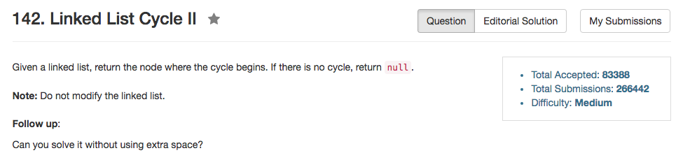

## Algorithm 

- 首先用传统的two pointer的方法找到是不是有cycle
- 如果的确是存在cycle，那么问题就在于找到cycle的起点。有意思的是，当`slow == fast`的时候，他们距离cycle的起点跟`head`距离cycle的起点是一样的，所以把一个放回`head`，一个原地不动，然后他们同时同样的速度向前进，当他们再次相遇的时候，他们会相遇在cycle的起点
- 上面算法成立的原因是，假设`slow`走了`k`步之后他们相遇，那么`fast`走了`2k`步，
    1. 设`out`是cycle外面的链表结点数量，`in`是两者相遇的时候他们已经遍历的cycle里面的结点数量, `N`是cycle的总结点数量。
    2. `k = out + in`，所以 `2k = 2out + 2in`
    3. `2k = out + in + N`，所以`N = in + out`
    4. 也就是说，从`in`位置走`out`步，刚好把整个圈走完一遍，而且这一遍是从cycle的第一个结点开始算起的。而这个距离正好是`head`都cycle起点的距离，所以上面的算法成立


## Comment

- 这个题目主要是注意一下判断`return NULL`的条件就好了。

## Code

```C++
class Solution {
public:
    ListNode *detectCycle(ListNode *head) {
        ListNode *fast = head, *slow = head;
        while (fast != NULL && fast->next != NULL){
            fast = fast->next->next;
            slow = slow->next;
            if (fast == slow) break;
        }
        if (fast == NULL || fast->next == NULL) return NULL;
        slow = head;
        while (fast != slow){
            fast = fast->next;
            slow = slow->next;
        }
        return fast;
    }
};
```

