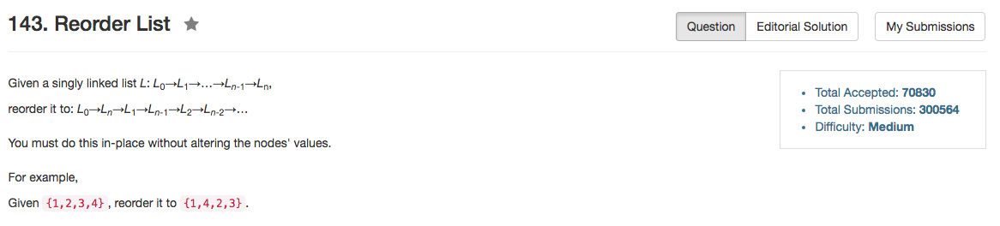

## Algorithm 

- 这个题目的解法我是从[这里](https://discuss.leetcode.com/topic/4061/my-o-n-c-method-accepted)学到的。
    1. 通过two pointer的方法把整个链表分半
    2. 然后把后半边的链表reverse
    3. 然后把两半链表合并起来。
- 但是[这里](https://discuss.leetcode.com/topic/7425/a-concise-o-n-time-o-1-in-place-solution/2)的Java程序写得更美一点，主要是reverse链表的算法可以用iteration这一点要学。

## Comment

- 链表的操作

## Code

```C++
class Solution {
public:
    void reorderList(ListNode* head) {
        if (head == NULL || head->next == NULL) return;
        ListNode *fast = head, *slow = head;
        while (fast!=NULL && fast->next!=NULL){
            fast = fast->next->next;
            slow = slow->next;
        }
        fast = reverse(slow->next);
        slow->next = NULL;
        slow = head;
        while (fast){
            ListNode *tmpSlowNext = slow->next;
            ListNode *tmpFastNext = fast->next;
            slow->next = fast;
            fast->next = tmpSlowNext;
            fast = tmpFastNext;
            slow = tmpSlowNext;
        }
    }
private:
    ListNode* reverse(ListNode* head){
        if (!head || !head -> next) {
            return head;
        } else {
            ListNode* feedback = reverse(head->next);
            ListNode* tmp = head->next;
            head->next = tmp->next;
            tmp->next = head;
            return feedback;
        }
    }
};
```

这里是摘录[这里](https://discuss.leetcode.com/topic/7425/a-concise-o-n-time-o-1-in-place-solution/2)的Java程序，主要是学习一下reverse的迭代写法

```Java
// O(N) time, O(1) space in total
void reorderList(ListNode *head) {
    if (!head || !head->next) return;
    
    // find the middle node: O(n)
    ListNode *p1 = head, *p2 = head->next;
    while (p2 && p2->next) {
        p1 = p1->next;
        p2 = p2->next->next;
    }
    
    // cut from the middle and reverse the second half: O(n)
    ListNode *head2 = p1->next;
    p1->next = NULL;
    
    // Reverser Linked List
    p2 = head2->next;
    head2->next = NULL;
    while (p2) {
        p1 = p2->next;
        p2->next = head2;
        head2 = p2;
        p2 = p1;
    }
    
    // merge two lists: O(n)
    for (p1 = head, p2 = head2; p1; ) {
        auto t = p1->next;
        p1 = p1->next = p2;
        p2 = t;
    }
    
}
```
