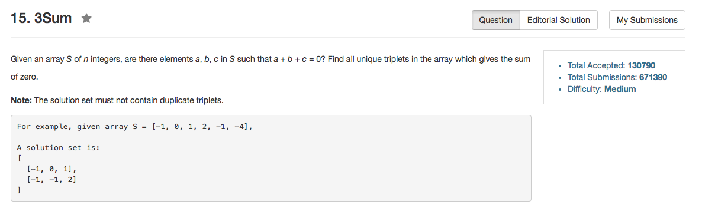

## Algorithm 

- 这个题目思路不难，但是判重是个大麻烦。
- 首先排序一下会方便很多，使得整个序列从下到大排列。然后每次枚举**最小的那个数**，再在后面的序列中寻找是否存在两个数，使得三个数的和为0。由于整个序列是有序的，在寻找后面两个数的时候可以直接用two pointers，一前一后向中间收拢。
- 但是问题就是在于判重。
  1. 如果在后面的序列找到了一个解`leftVal` & `rightVal`，那么后面序列中左指针跳过所有和`leftVal`值相同的位置，右指针跳过所有和`rightVal`值相同的位置，这样就能防止在最小数相同的情况下，整个加和序列相同。
  2. 如果当前最小数等于上一个最小数，那就直接跳过当前位置，以下一个位置的值作为最小数。
- 这里有一个非常tricky的地方，就是为什么枚举的是最小值。
  - 我一开始枚举的是最大值，但是整个判重就非常麻烦，原因是[0,0,0,0]这种情况，如果枚举最小值，那么在第一个[0,0,0]的解出来之后，剩下的都可以直接跳过。但是如果枚举的是最大值，在第一个解出来之后，很难判断下一个最大值为0的时候要不要直接跳过。具体原因我不在这里多说了，但是就是非常麻烦。

## Comment

- 判重花了很多时间，而且算法设计的不好直接影响判重的复杂程度。

## Code

```C++
class Solution {
public:
    vector<vector<int>> threeSum(vector<int>& nums) {
        if (nums.size()<3) return vector<vector<int>>({});
        sort(nums.begin(), nums.end());
        vector<vector<int>> results;
        for (int i = 0; i != nums.size() - 2; i++){
            if (i > 0 && nums[i] == nums[i - 1]) continue;
            int left = i + 1, right = nums.size() - 1;
            while (left < right){
                if (nums[left] + nums[right] + nums[i] == 0) {
                    int leftVal = nums[left], rightVal = nums[right];
                    results.push_back(vector<int>({leftVal, rightVal, nums[i]}));
                    while (left < right && nums[left] == leftVal) left++;
                    while (left < right && nums[right] == rightVal) right--;
                } else if (nums[left] + nums[right] + nums[i] > 0){
                    right--;
                } else {
                    left++;
                }
            }
        }
        return results;
    }
};
```
