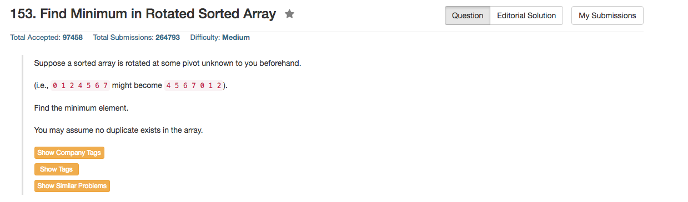

## Algorithm 

- 这个本质上是Binary Search，一个`left`，一个`right`。
- 如果`nums[right] >= nums[mid]`: 说明从mid到right是一个递增序列，那么答案在mid的左侧（包括mid）
    - 一般来说，`right = mid - 1;`是常用的更新方式，但是如果某一次更新`right < 0 || nums[right] > nums[mid]`
    - 那么说明1)mid是这个数组的第一个元素，或者2)right以及之前的元素是降序排列的。
    - 这两种情况都说明nums[mid]是最小值
- 如果`nums[right] < nums[mid]`: 说明从left到mid是一个递减序列，那么答案在mid的右侧(包括mid)
    - 一般来说，`left = mid + 1;` 是常用的更新方式。
    - 因为循环条件是`while (left < right)`，所以`left`最多最多会跟`right`相等，不会超出数组界限。
    - 如果循环结束了，那么`nums[left]`是最小值。
- 现在的问题就是Binary Search什么时候截止，以及每次更新怎么移动left和right


## Comment

- Binary Search不好写啊。

## Code


```c++
class Solution {
public:
    int findMin(vector<int>& nums) {
        int left = 0, right = nums.size() - 1;
        while (left < right){
            int mid = left + (right - left) / 2;
            if (nums[right] >= nums[mid]){
                right = mid - 1;
                if (right < 0 || nums[right] > nums[mid]) return nums[mid];
            } else { 
                left = mid + 1;
            }
        }
        return nums[left];
    }
};
```