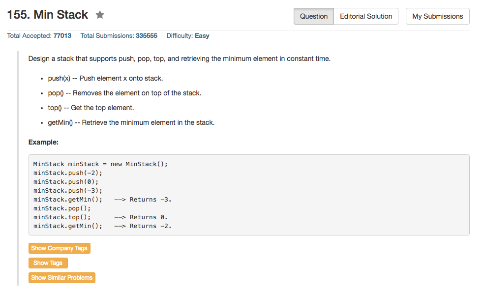

## Algorithm 

- 这个题目最简单的做法是开两个栈，一个栈(dataStack)记录真实数据，另外一个栈(minStack)记录到现在为止的最小值。压栈的时候，dataStack压入真实数据，minStack压如当前最小值和最新数据的最小值。如果是`getMin()`，就从minStack里面取；如果是`top()`，就从dataStack里面取；
- 当然，这个问题也可以使用指针等其他数据结构来完成minStack的作用，或者minStack不需要开一个跟dataStack同样大的数组。当然，这里为了简化程序，我就直接开了一个同样大的数组了。

## Comment

- 还是没有搞得很清楚OOP中的declaration和用constructor来初始化的差别，所以那个MinStack()函数很捉急。
- 另外，minStack压栈时候的边界条件一开始没有能够注意，是个问题。

## Code


```c++
class MinStack {
public:
    /** initialize your data structure here. */
    stack<int> dataStack;
    stack<int> minStack;
    MinStack() {
        stack<int> dataStack;
        stack<int> minStack;
    }
    
    void push(int x) {
        dataStack.push(x);
        if (minStack.size()) 
            minStack.push(min(x, minStack.top()));
        else
            minStack.push(dataStack.top());
    }
    
    void pop() {
        dataStack.pop();
        minStack.pop();
    }
    
    int top() {
        return dataStack.top();
    }
    
    int getMin() {
        return minStack.top();
    }
};

```