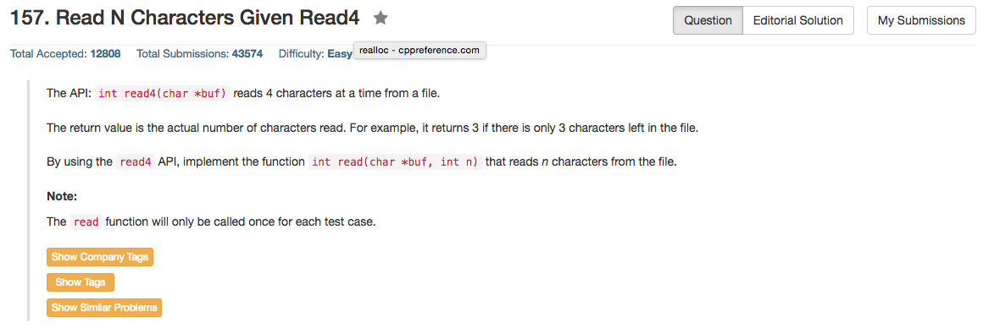

## Algorithm 

- 这个题目主要是要注意细节，尤其是C++/C语言的实现，由于涉及到内存访问的问题，很多细节要注意。
- 老实说我觉得讨论中绝大部分C++的解法都是错的，只有[这里](https://leetcode.com/discuss/88841/c-0ms-solution)的解法我认为是对的。
- 这个题目其实有很多问题
    1. `n > 真正存在的文本长度`: 很多人通过判断最后一次读入数是不是小于4来决定是否读到了文本的EOF。
    2. `真正文本的长度 > n`: 这个很多人没有判断，关键就是比如`n = 3`，但是文本有4个，这个时候read4会读进来4个字符，但是buf的大小实际上只有3，如果直接用read4(buf)的话，buf就会overflow，可能访问非法内存。所以理论上需要一个temporary buff，然后看到到底这个temporary buff里面有多少个要放入真正的buf
- 当然这道题目还是有点说的不清楚，C++写起来不是很合适。

## Comment

- 字符操作和内存空间分配都是C和C++里面非常要小心的问题。

## Code

这个是我的错误的版本，错误的原因是没有考虑的上面第二点，但是我暂时不想再修改了。

```C++
// Forward declaration of the read4 API.
int read4(char *buf);

class Solution {
public:
    /**
     * @param buf Destination buffer
     * @param n   Maximum number of characters to read
     * @return    The number of characters read
     */
    int read(char *buf, int n) {
        int count = 0, readNum;
        for (int i = 0; i <= (n - 1) / 4; i++){
            readNum = read4(buf + count);
            count = count + readNum;
            if (readNum < 4) break;
        }
        return min(count, n);
    }
};
```

以下是我觉得比较正确的代码，来自[这里](https://leetcode.com/discuss/88841/c-0ms-solution)

```c++
class Solution {
public:
    /**
     * @param buf Destination buffer
     * @param n   Maximum number of characters to read
     * @return    The number of characters read
     */
    int read(char *buf, int n) {
        char * tmpBuffer=new char[4];
        int theRest=n%4;
        int numEach=0;
        int i=0;
        while( (numEach = read4(tmpBuffer)) && i < n ) {
            if(i + numEach > n) {
                memcpy(buf+i, tmpBuffer, theRest);
                return n;
            }
            memcpy(buf+i, tmpBuffer, numEach);
            i += numEach;
        }
        return i;
    }
};
```