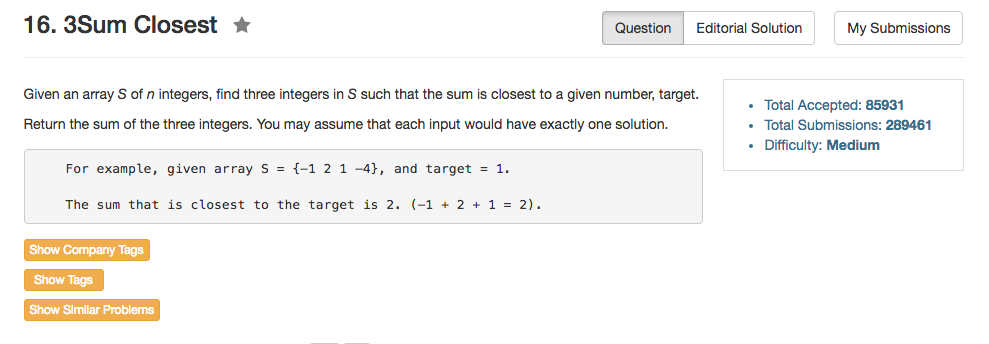

## Algorithm 

- 在15题的基础上做这道题目就非常容易了。基本上也就是用two pointer走就好了。先排序，然后枚举三个数里面最小的那个，然后后面两个数在剩下的后面的数中选择，从两端向中间收拢。过程中不断更新最小差值，并且储存最小差值对应的答案。
- [这里](https://discuss.leetcode.com/topic/1978/a-n-2-solution-can-we-do-better)的解答和程序还是蛮有意思的。

## Comment

- `INT_MAX`这个值还是要记得
- 一开始报错了答案，搞成了返回跟target最小的差值，但是实际上是要返回那个最小差值的实际结果。

## Code

```C++
class Solution {
public:
    int threeSumClosest(vector<int>& nums, int target) {
        sort(nums.begin(), nums.end());
        int minimal = INT_MAX, ans = INT_MAX;
        for (int i = 0; i != nums.size() - 2; i++){
            int left = i + 1, right = nums.size() - 1;
            while (left < right){
                if (abs(nums[i] + nums[left] + nums[right] - target) < minimal){
                    minimal = abs(nums[i] + nums[left] + nums[right] - target);
                    ans =nums[i] + nums[left] + nums[right];
                };
                if (nums[i] + nums[left] + nums[right] - target > 0){
                    right--;
                } else {
                    left++;
                }
            }
        }
        return ans;
    }
};
```
