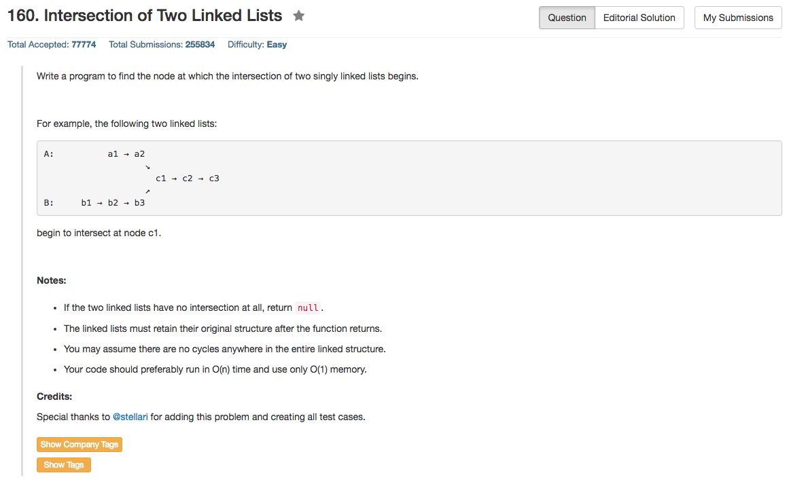

## Algorithm 

- 这个题目的解法非常有意思，我最初的想法跟解法相似，但是还是没有能够想到最后的点子上。
- 这个题目的思路就是把问题变成环，然后找这两个链表是否有环，以及环的入口在哪；这个题目跟之前的p判断一个链表是否存在环的题目有共同点。
- 一个指针从headA开始走，如果走到了NULL，就往headB继续走；另一个指针从headB开始走，如果走到了NULL，就往headA继续走
    1. 如果两个链表有交叉，那么在n+m步以后，两个指针会在intersection的结点相遇，因为任何一个指针第二次走到intersection的结点的距离都是n+m
    2. 如果两个链表没交叉，那么你可以看做两个链表实际上在NULL这个点相交了，同样也是在n+m步后，两个指针第二次走到同一个结点，这个情况下是NULL
- 这个题目的解法实在是太好玩了，来源于[这里](https://leetcode.com/discuss/88940/simple-c-solution-5-lines)和[这里](https://leetcode.com/discuss/31067/share-my-simple-java-solution-o-n-time-o-1-space)

## Comment

- 链表也是有很多有趣的小题目值得人思考的。

## Code

```c++
/**
 * Definition for singly-linked list.
 * struct ListNode {
 *     int val;
 *     ListNode *next;
 *     ListNode(int x) : val(x), next(NULL) {}
 * };
 */
class Solution {
public:
    ListNode *getIntersectionNode(ListNode *headA, ListNode *headB) {
        ListNode *goA = headA, *goB = headB;
        while (goA != goB){
            goA = goA ? goA->next : headB;
            goB = goB ? goB->next : headA;
        }
        return goA;
    }
};
```