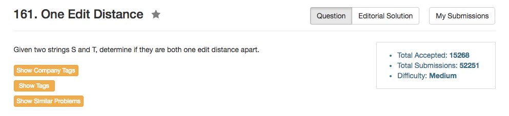

## Algorithm 

- 这个题目其实比较直接，就是从前到后找到第一个不相同的位置`i`，然后判断
    1. 如果`len(s) == len(t)`，那么`i+1`开始的所有子串都应该相同
    2. 如果`len(s) > len(t)`，那么`s[i+1]`和`t[i]`开始的子串应该完全相同
    3. 如果`len(s) < len(t)`，那么`s[i]`和`t[i+1]`开始的子串应该完全相同


## Comment

- String的操作要注意: `s.substr(start, length)`
- 边界条件是个大问题，比如最后返回的时候，要考虑"a"和"ac", "a"和""的两种情况，也就是说，当循环已经遍历完成了，但是实际上有一个trailing的判断还没有完成。
- String计算长度也是个麻烦事，没想清楚就会算错。

## Code

我的程序，比较冗长，直接看下面的比较好。

```C++
class Solution {
public:
    bool isOneEditDistance(string s, string t) {
        int i = 0, lenS = s.length(), lenT = t.length(), lenMin = min(lenS, lenT);
        for (i = 0; i != lenMin; i++){
            if (s[i] != t[i]){
                string tmpS = s.substr(i + (lenS >= lenT), lenS - i - (lenS >= lenT));
                string tmpT = t.substr(i + (lenT >= lenS), lenT - i - (lenT >= lenS));
                return tmpS == tmpT;
            }
        }
        return (lenS - i == 1 || lenT - i == 1);
    }
};
```

