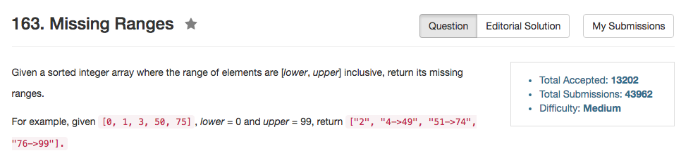

## Algorithm 

- 这个题目其实蛮trivial的，而且跟之前的那个区间合并的题目差不多。
- 我的算法要考虑lower在nums[0]之前，upper在nums[end]之后，还要考虑每一个部分，非常的不统一。要考虑各种特殊情况。
- 但是，[这里](https://discuss.leetcode.com/topic/16119/simply-0ms-c-solution)这个程序就写得很好，值得学习。

## Comment

- 边界条件处理太麻烦了。
- 比如nums是空的
- 比如nums[0]比lower大
- 比如nums[end]比lower小
- 我都没有能够完全考虑到所有的情况。

## Code

[这里](https://discuss.leetcode.com/topic/16119/simply-0ms-c-solution)是很好的写法

```C++
class Solution {
public:
    string get_range(int start, int end)
    {
        return start==end? to_string(start) : to_string(start)+"->"+to_string(end);
    }
    vector<string> findMissingRanges(vector<int>& nums, int lower, int upper) {
        vector<string> result;
        int pre = lower-1; //use lower - 1 is clever
        for(int i =0; i <= nums.size(); i++)
        {
           int cur = (i==nums.size()? upper+1:nums[i]);
           if(cur-pre>=2)
            result.push_back(get_range(pre+1,cur-1));
            pre = cur;
        }
        return result;
    }
};
```

我的算法的解：

```C++
class Solution {
public:
    vector<string> findMissingRanges(vector<int>& nums, int lower, int upper) {
        vector<string> results;
        if (nums.size() == 0) {
            results.push_back(convert(lower, upper));
        } else { 
            int travel = lower;
            if (travel < nums[0]){
                results.push_back(convert(travel, nums[0] - 1));
                travel = nums[0];
            }
            for (int i = 0; i != nums.size(); i++){
                if (nums[i] > travel + 1){
                    results.push_back(convert(travel + 1, nums[i] - 1));
                }
                travel = nums[i];
            }
            if (travel < upper){
                results.push_back(convert(travel + 1, upper));
            }
        }
        return results;
    }
private:
    string convert(int start, int end){
        if (start == end){
            return to_string(start);
        } else {
            return to_string(start) + "->" + to_string(end);
        }
    }
};
```
