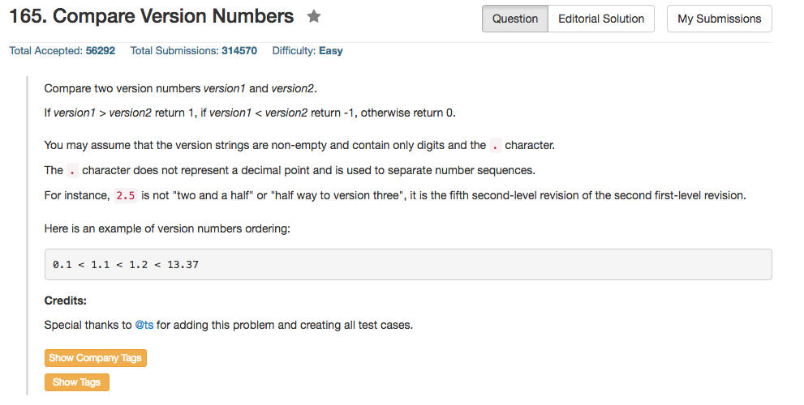

## Algorithm 

- 这个题目重要的问题就是版本号到底有多少层，这个问题肯定是要问面试官的，我一开始想的是固定的层数，但是很显然测试数据和『常理推断』版本号的层数可能变化很大。
- 后来看了讨论里面的一个思路，然后发现我们只要关注当前同一层的版本号就好了，所以也就是两个版本号，每次都取到同一个'.'前位置，然后比较版本号。
- 为了方便处理边界条件，我在每一个版本号后面都加上了'.'，这样在循环的时候整体比较容易，减少了一些判断数组尾部的判断条件和冗余。
- 最后就是如果`version1 = 1; version2 = 1.1`这种情况，所以在最开始的`for`循环的结束条件的时候也要注意一下边界。

## Comment

- 这个题目的边界条件实在是太多了，面试的时候要问清楚，比如有几个'.'，有没有存在版本号长度子长度不一样，等等问题。
- 在设计程序的时候的确是要考虑到一点：永远假设用户的输入是非常乱、非常糟糕的。这样才能保证在各种诡异的输入的情况下仍然保持良好的robustness.

## Code

```c++
class Solution {
public:
    int compareVersion(string version1, string version2) {
        int pointer1 = 0, pointer2 = 0;
        int v1 = 0, v2=0;
        version1 = version1 + '.';
        version2 = version2 + '.';
        for (int i = 0, j = 0; i < version1.size() || j < version2.size();){
            while (i < version1.size() && version1[i] != '.') v1 = v1 * 10 + version1[i++] - '0';
            while (j < version2.size() && version2[j] != '.') v2 = v2 * 10 + version2[j++] - '0';
            if (v1 > v2) 
                return +1;
            else if (v1 < v2)
                return -1;
            else {
                i++, j++;
                v1 = 0;
                v2 = 0;
            }
        }
        return 0;
    }
};
```
