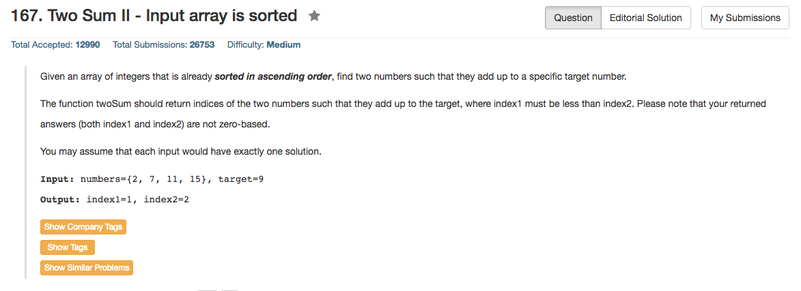

## Algorithm 

- 主要是要利用这个数组已经是有序的这个条件
    - 算法一：一个指针从前到后，一个指针二分查找 O(NlogN)，太慢
    - 算法二：两个指针都是二分查找，[这里](https://leetcode.com/discuss/104150/share-my-c-o-log-2-n-solution)有讨论，虽然看上去是O(log^2 N)的，但是最坏情况下是O(N)的，具体看下面的那个例子。
    - 算法三：两个指针一前一后，由于这是个有序数组，我们就逐渐地缩小两个指针的范围就可以了，比如如果`numbers[low] + numbers[high] > targer`，这个说明较大的那个数太大，这样就把`high--`；类似的，如果前面那个数太小，就用`low++`。
- 当然也可以无视这个条件直接用unordered_map，时间上也还是O(N)的，但是估计这么做了就会直接拒掉了。

## Comment

- 简单的问题有了特殊条件以后也要注意更加有没的算法，这个题目就是典型的例子。算法三很不错


## Code

算法一

```c++
class Solution {
public:
    vector<int> twoSum(vector<int>& numbers, int target) {
        int index1 = -1, index2 = -1;
        for (int i = 1; i < numbers.size(), index1 < 0; i++){
            int left = 0, right = i - 1, mid;
            while (left <= right){
                mid = left + (right - left) / 2;
                printf("%d %d\n", numbers[mid], numbers[i]);
                if (numbers[mid] + numbers[i] == target) {
                    index1 = mid;
                    index2 = i;
                    break;
                } else if (numbers[mid] > target - numbers[i]){
                    right = mid - 1;
                } else {
                    left = mid + 1;
                }
            }
        }
        return {index1 + 1, index2 + 1};
    }
};
```

算法三，代码来自[这里](https://leetcode.com/discuss/33192/a-simple-o-n-solution)

```c++
vector<int> twoSum(vector<int>& numbers, int target) {
    int lo=0, hi=numbers.size()-1;
    while (numbers[lo]+numbers[hi]!=target){
        if (numbers[lo]+numbers[hi]<target){
            lo++;
        } else {
            hi--;
        }
    }
    return vector<int>({lo+1,hi+1});
}
```

直接使用hash表，无视有序数组
```c++
class Solution {
public:
    vector<int> twoSum(vector<int>& numbers, int target) {
        std::unordered_map<int, int> hash;
        for (int i = 0; i < numbers.size(); i++){
            if (hash.find(target - numbers[i]) != hash.end()){
                return {hash[target - numbers[i]]+1, i+1};
            } else {
                hash[numbers[i]] = i;
            }
        }
        return {1, 1}; //这么写并不合适，这里是保留万一不存在解的情况
    }
};
```

