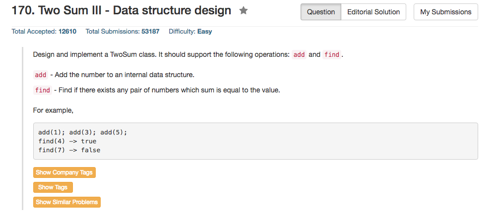

## Algorithm 

- 这个题目本质上来说跟之前没有什么差别，既然已经说明了是数据结构的设计，那就的确是数据结构的设计。
- 当然，重要的数据结构的设计就是用Hash表，不然一定会很慢
- 但是有一个问题在于，在`find()`的时候要如何遍历当前的数据结构。一开始我不知道怎么遍历`unordered_map`，所以开了另外一个数组傻傻地直接遍历这个数组。很想然这种方法非常慢，尤其是在重复元素很多的情况下。最直观的想法是遍历整个hash表，这样可以大量减少冗余。但是如何遍历hash表就成了问题，因为我一开始并不知道C++中类似Pyhton的`for key in Hash:`这种遍历方式，但是最后发现C++中有一个有趣的`for (auto p:hash)`。这种遍历的方式跟Python比较类似，但是我还需要阅读一下这是怎么回事

## Comment

- 这道题目是难得的C++的程序整体比python和java的程序慢的一道题目，可能是因为C++默认实现hash表的方法比较慢。
- 遍历`unordered_map`是个问题，理论上是要用对应的`iterator`才行。
- 但是这里有一个`for (auto p:hash)`这个写循环的方法，这种写循环的方法，尤其是这个`auto p`的写法，以前从来没有写过，而且肯定在C里面是没有的，这种写法很像python等其他语言的循环写法，需要了解一下。

## Code

当然还是用了`unordered_map`来实现的，[这里](https://leetcode.com/discuss/50800/short-and-fast-c)讨论了关于使用`hash.count()`和`hash.find()!=hash.end()`在时间上的差距。似乎前面一种的速度要快一些。但是我记得之前的讨论中说到后一种的速度要快一些。

```c++
class TwoSum {
private:
    std::unordered_map<int, int> hash;

public:
    // Add the number to an internal data structure.
  void add(int number) {
      hash[number]++;
  }

    // Find if there exists any pair of numbers which sum is equal to the value.
  bool find(int value) {
        for (auto p:hash){
            if (hash.count(value - p.first)){
                if (2 * p.first != value) 
                    return true;
                else if (p.second > 1)
                    return true;
            }
        } 
      return false;
  }
};

```

[这里](https://leetcode.com/discuss/59376/fast-and-concise-c-multiset-solution)提供了一个蛮有意思的用`unordered_multiset<int>`的C++的程序，也算是学习一下吧，虽然我觉得跟`unordered_set`或者`unordered_map`的实现方法也没有重大的区别。

```c++
class TwoSum {
    unordered_multiset<int> nums;
public:
    void add(int number) {
        nums.insert(number);
    }
    bool find(int value) {
        for (int i : nums) {
            int count = i == value - i ? 1 : 0;
            if (nums.count(value - i) > count) {
                return true;
            }
        }
        return false;
    }
};
```