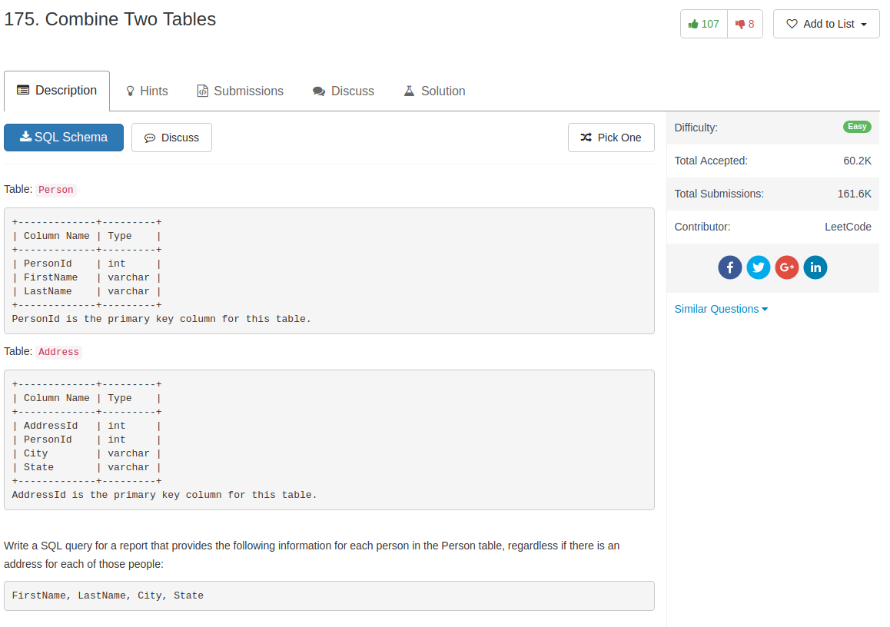

## Code

```sql
SELECT p.FirstName, p.LastName, a.City, a.State
FROM Person p
LEFT JOIN Address a
ON p.PersonId = a.PersonId
```

looks like in this case, the `p.` part in `p.FirstName` can be ignored

```sql
SELECT FirstName, LastName, City, State
FROM Person LEFT JOIN Address
ON Person.PersonId = Address.PersonId
```
