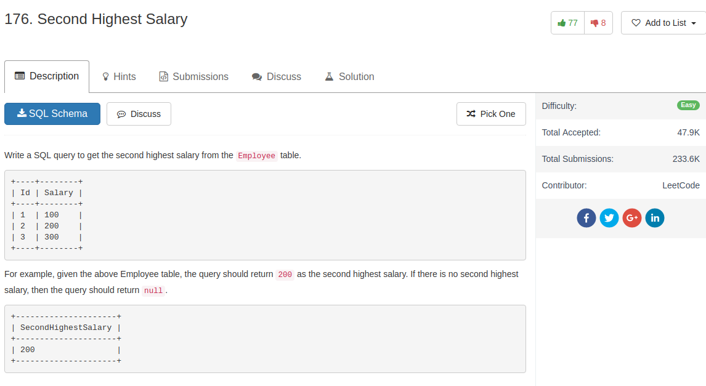

## Comment

- The question require return `NULL` if no answer is found -- this can only be done with `Max` function which returns NULL

## Code

```sql
select max(Salary) as SecondHighestSalary
from Employee
where Salary < (select max(e.Salary) from Employee e )
```
