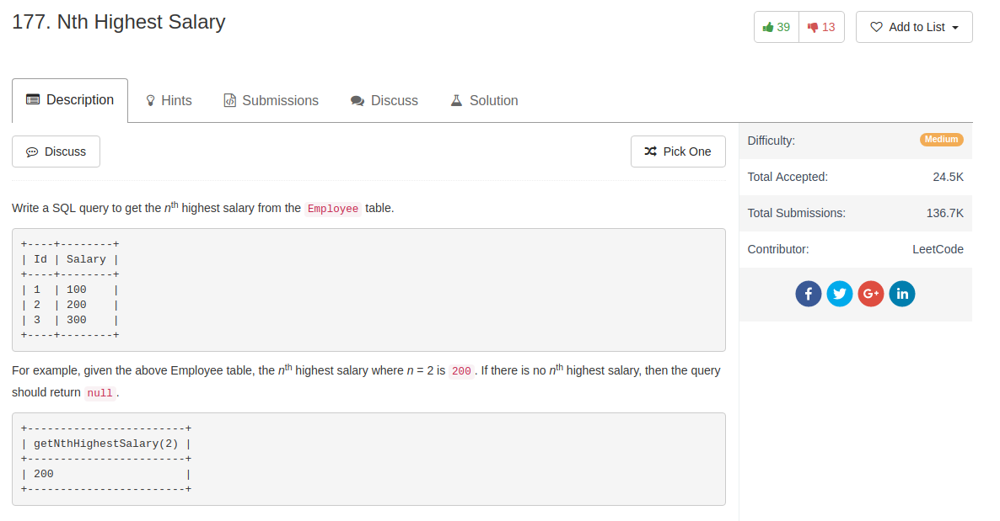

## Knowledge point

1. To do the operations: You can use `set N = N-1` or `Declare M INT Set M = N-1` to go around the nth largest

## Comment

- really didn't know we ca use `set N=N-1` to modify the value of N.
- the usage of `limit`
  - `limit [offset, row]`, or
  - `limit [row] offset [offset]`

## Code

```sql
CREATE FUNCTION getNthHighestSalary(N INT) RETURNS INT
BEGIN
  DECLARE M INT;
  SET M=N-1;
  RETURN (
      # Write your MySQL query statement below.
      SELECT DISTINCT Salary FROM Employee ORDER BY Salary DESC LIMIT M, 1
  );
END
```
