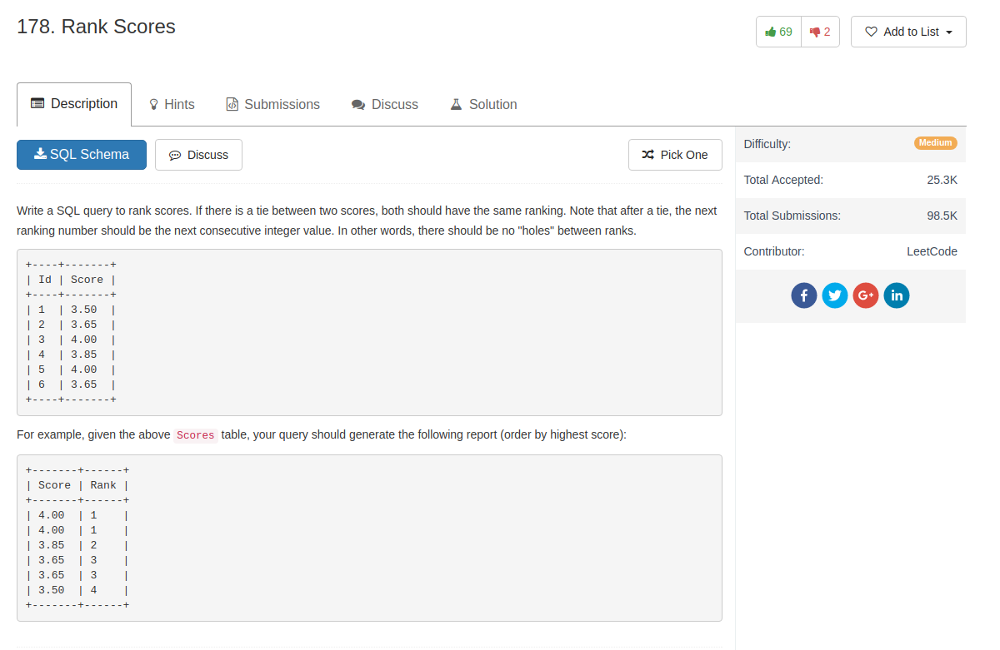

## Knowledge point

1. if want get `count`, we can use subquery `select count(*) from ...`

## Comment

- All solutions are from online


## Code

```sql
SELECT
  Score,
  (SELECT count(distinct Score) FROM Scores WHERE Score >= s.Score) Rank
FROM Scores s
ORDER BY Score desc
```

another solution from others

```sql
SELECT
  Score,
  (SELECT count(*) FROM (SELECT distinct Score s FROM Scores) tmp WHERE s >= Score) Rank
FROM Scores
ORDER BY Score desc
```

or join in a weird way

```sql
SELECT s.Score, count(distinct t.score) Rank
FROM Scores s JOIN Scores t ON s.Score <= t.score
GROUP BY s.Id
ORDER BY s.Score desc
```
