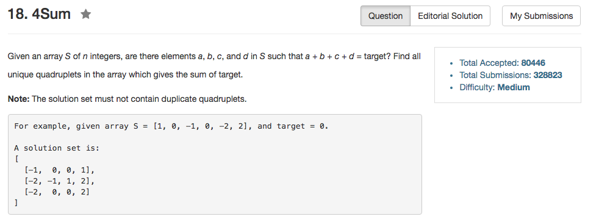

## Algorithm 

- 在15题、16题的基础上，这个题目就好做了。
- 基本的思路就是先排序，然后1.枚举最小的; 2.枚举次小的; 3. 然后在剩下的数中从左右向中间收拢，找到解。
- 判重的话，就是
    1. 如果最小的跟之前一样，跳过
    2. 如果次小的跟之前一样，跳过
    3. 如果左边或者右边跟之前一样，跳过
- 有意思的是，[这里](https://discuss.leetcode.com/topic/27445/lower-bound-%CF%89-n-3/6)说到这个题目的时间复杂度下限是O(n^3)，但是我不是很确定我读明白了。

## Comment

- 基本就是按图索骥。

## Code

```C++
class Solution {
public:
    vector<vector<int>> fourSum(vector<int>& nums, int target) {
         if (nums.size() < 4) return vector<vector<int>>();
         sort(nums.begin(), nums.end());
         vector<vector<int>> ans;
         for (int i = 0; i != nums.size() - 3; i++){
             if (i > 0 && nums[i] == nums[i - 1]) continue; 

             for (int j = i+1; j != nums.size() - 2; j++){
                 if (j > i + 1 && nums[j] == nums[j - 1]) continue;

                 int left = j + 1, right = nums.size() - 1;
                 while (left < right){
                     int currentSum = nums[i] + nums[j] + nums[left] + nums[right];
                     if (currentSum == target){
                         ans.push_back(vector<int>({nums[i], nums[j], nums[left], nums[right]}));
                
                         int lval = nums[left], rval = nums[right];
                         while (nums[left] == lval) left++;
                         while (nums[right] == rval) right--;
               
                     } else if (currentSum > target) {
                         right --;
                     } else {
                         left ++;
                     }
                 }
             }
         }
         return ans;
    }
};
```
