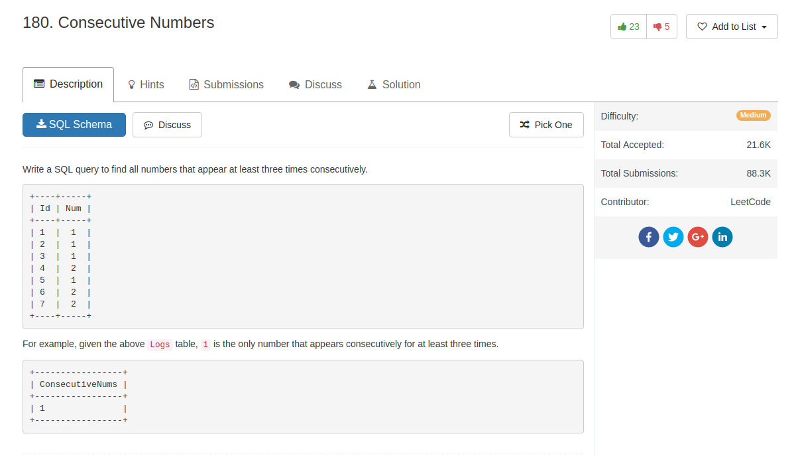

## Comment

- cross product and `distinct` are enough

## Code

```sql
select distinct l1.num as ConsecutiveNums
from Logs l1, Logs l2, Logs l3
where l1.Id = l2.Id + 1 and l2.Id = l3.Id + 1 and l1.num = l2.num and l2.num = l3.num
```
