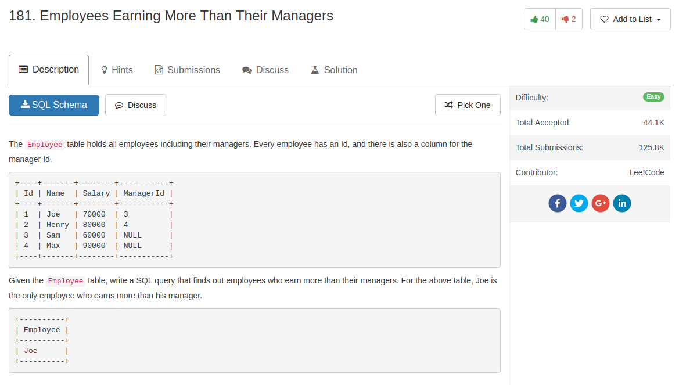

## Comment

- if `from` two tables simultaneously, then it is `join` two tables and get a Cartesian product

## Code

my code, use `join`

```sql
select e1.Name as Employee
from Employee e1
join Employee e2
on e1.ManagerId = e2.Id and e1.Salary > e2.Salary
```
use `where` and `from` two tables

```sql
SELECT
    a.Name AS 'Employee'
FROM
    Employee AS a,
    Employee AS b
WHERE
    a.ManagerId = b.Id
        AND a.Salary > b.Salary
```
