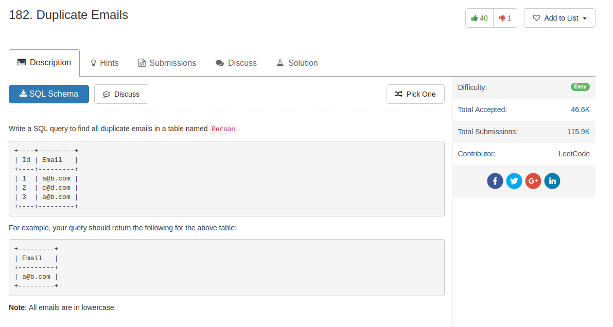

## Code

```sql
select distinct Email
from Person
group by Email
having count(Id) > 1
```

Another solution with sub-query by creating a new table


```sql
select Email from
(
  select Email, count(Email) as num
  from Person
  group by Email
) as statistic
where num > 1
```
