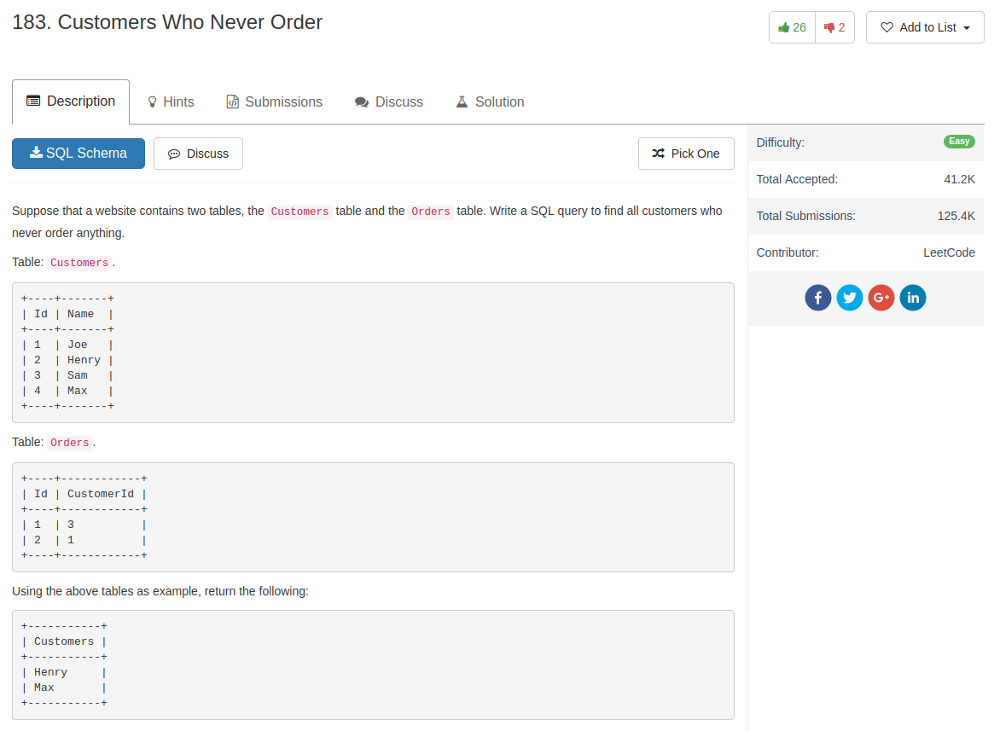

## Code

My answer

```sql
select Name as Customers
from Customers
where Id not in (
    select c.Id
    from Customers as c
    join Orders
    on c.Id = Orders.CustomerId)
```

Provided solution is better

```sql
select customers.name as 'Customers'
from customers
where customers.id not in
(
    select customerid from orders
);
```
