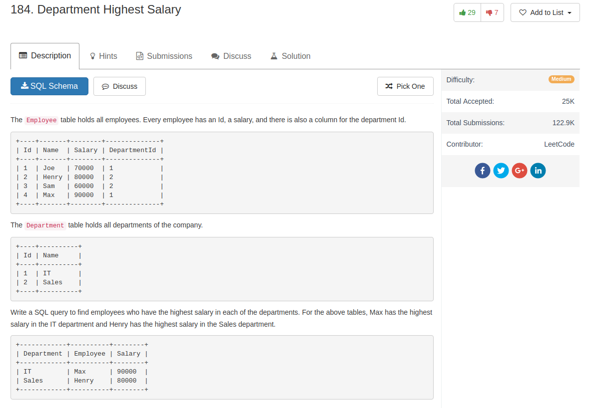

## Comment

- There could be multiple Employees who have the highest salary.


## Code

```sql
select d.Name as Department, e.Name as Employee, e.Salary
from Employee e
  join Department d on d.Id = e.DepartmentId
where e.Salary = (
  select
    max(Salary)
  from
    Employee e2
  where e2.DepartmentId = d.Id)

```

or use `join` and `in`

```sql
SELECT
    Department.name AS 'Department',
    Employee.name AS 'Employee',
    Salary
FROM
    Employee
        JOIN
    Department ON Employee.DepartmentId = Department.Id
WHERE
    (Employee.DepartmentId , Salary) IN
    (   SELECT
            DepartmentId, MAX(Salary)
        FROM
            Employee
        GROUP BY DepartmentId
    )
```

or cross product

```sql
SELECT D.Name AS Department ,E.Name AS Employee ,E.Salary
FROM
	Employee E,
	(SELECT DepartmentId,max(Salary) as max FROM Employee GROUP BY DepartmentId) T,
	Department D
WHERE E.DepartmentId = T.DepartmentId
  AND E.Salary = T.max
  AND E.DepartmentId = D.id
```
