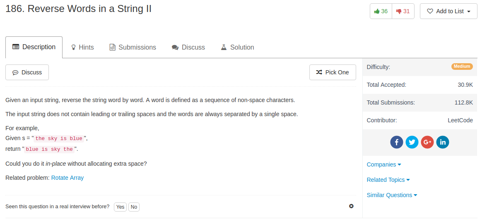

## Algorithm

- 题目都已经提示了要in-place，那么直接想in-place的方法
- 先把整个字符串reverse
- 然后找到空格，把空格之间的词再reverse就好了
- 要注意的是，最后一个词容易被忘记reverse back —— 边界条件！

## Comment

- python要reverse一个list的一部分的方法
  - `s[start:ind] = s[start:ind][::-1]`
  - `s[start:ind] = reversed(s[start:ind])`
  - 但是要注意`s[start:ind].reversed()`这个没有用，因为这里实际上创立了一个`s[start:ind]`的copy，没有在in-place改变原来的list
## Code


```python
class Solution:
    # @param s, a list of 1 length strings, e.g., s = ['h','e','l','l','o']
    # @return nothing
    def reverseWords(self, s):
        s.reverse()
        start = 0
        for ind, char in enumerate(s):
            if char == ' ':
                s[start:ind] = s[start:ind][::-1]
                start = ind + 1
        s[start:len(s)] = s[start:len(s)][::-1]
```
