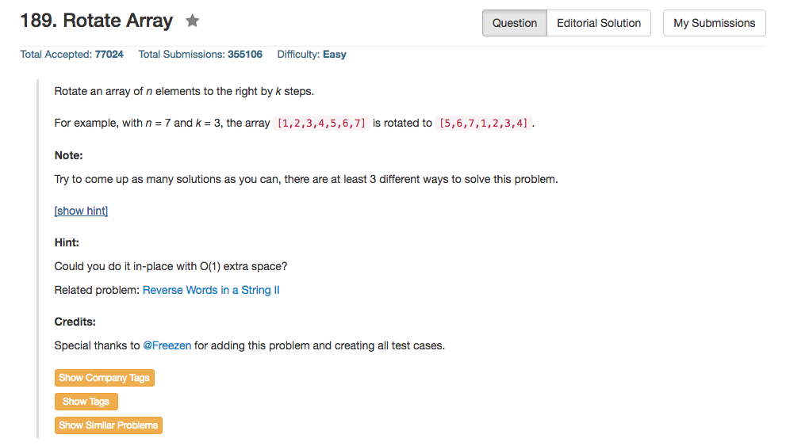

## Algorithm 

- 这理论上来说应该是一个简单的题目，但是我却做了很久很久。[这里](https://leetcode.com/discuss/27387/summary-of-c-solutions)的讨论总结了C++的五种算法，值得好好学习。
    1. 算法一：直接用另外一个数组存移动的序列就好了
    2. 算法二：从一个元素开始rotate，这个元素到它应该到的地方，然后那个地方本来的元素再继续走向自己应该到的地方。这样有点像是一个置换群的实现。
    3. 算法三：前n-k个先reverse，然后后k个reverse，然后整个数组reverse。这个算法很妙
    4. 算法四：交换前后的k的元素，然后再整理后n-k个元素的位置。
    5. 算法五：不断地交换前后的两个子数组，跟算法四有点相关。

## Comment

- 需要注意的是，如果needle是""，也就是空串，那么返回到答案是0。
- 关于needle是空串的返回值，这种边界条件一定要记得问面试官怎么定义，这种问题很蛋疼，但是也很重要。

## Code

算法一：直接拿另外一个算法存

```c++
class Solution {
public:
    void rotate(vector<int>& nums, int k) {
        int n = nums.size();
        vector<int> ans(n);
        for (int i = 0; i < n; i++)
            ans[(i + k) % n] = nums[i];
        nums = ans;
    }
};
```

算法三：三次reverse数组

```c++
    class Solution 
    {
    public:
        void rotate(int nums[], int n, int k) 
        {
            k = k%n;

            // Reverse the first n - k numbers.
            // Index i (0 <= i < n - k) becomes n - k - i.
            reverse(nums, nums + n - k);

            // Reverse tha last k numbers.
            // Index n - k + i (0 <= i < k) becomes n - i.
            reverse(nums + n - k, nums + n);

            // Reverse all the numbers.
            // Index i (0 <= i < n - k) becomes n - (n - k - i) = i + k.
            // Index n - k + i (0 <= i < k) becomes n - (n - i) = i.
            reverse(nums, nums + n);
        }
    };
```
