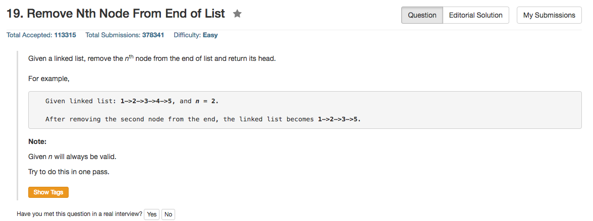

## Algorithm 

- 这个题目要求的One Pass的方法还是蛮有意思的，很值得学习和思考
    - Link List的One Pass的方法基本上离不开**two pointer**的解，问题的关键就是如何利用好这个Two Pointer
    - 这里的基本思路就是：一个Fast Pointer先走n步，使得这个Pointer跟Slow Pointer的距离为n
    - 然后Fast Pointer和Slow Pointer以同样的速度往前走：当Fast Pointer到达链表的最后的位置的时候，Slow Pointer刚好到达倒数第n个位置，然后把Slower Pointer所在的结点删除就好了。

## Comment

- C和C++里面要考虑使用pointer to pointer来操作链表删除，因为程序会非常干净，这里是一个很好的应用，值得注意实现的细节。

## Code

```c++
/**
 * Definition for singly-linked list.
 * struct ListNode {
 *     int val;
 *     ListNode *next;
 *     ListNode(int x) : val(x), next(NULL) {}
 * };
 */
class Solution {
public:
    ListNode* removeNthFromEnd(ListNode* head, int n) {
        ListNode** fast = &head;
        ListNode** slow = &head;
        while (n-- > 0) fast = &(*fast) -> next; //这里要注意下一个位置，以及操作符顺序
        while (*fast) {
            fast = &(*fast) -> next;
            slow = &(*slow) -> next;
        } 
        *slow = (*slow) -> next; //这里要注意实现的细节
        return head;
    }
};
```