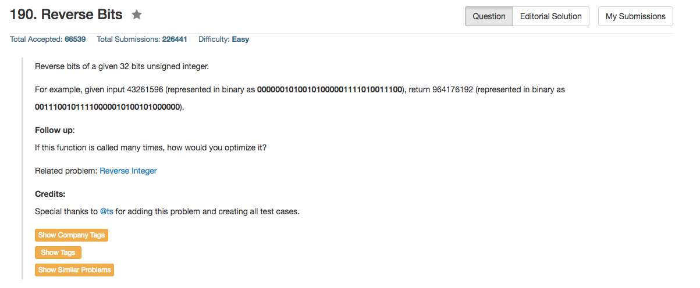

## Algorithm 

- 这个题目肯定是要考巧妙地位操作，然而我并不知道，所以我就直接扫了一遍，一开始还写错了
- [这里](https://leetcode.com/discuss/27405/o-1-bit-operation-c-solution-8ms)提供了一个O(log(sizeof(int)))的算法，讨论里面提到 _Hackers Delight_ 里面也提到了这个。有空准备看一下那本书，我依稀记得我可能有那本书的中文版。

## Comment

- 位操作总是有很多Hack在里面的

## Code

```c++
class Solution {
public:
    uint32_t reverseBits(uint32_t n) {
        uint32_t result = 0;
        for (int i = 0; i < 32; i++) result = (result << 1) | ((n >> i) & 1);
        return result;
    }
};
```

更加快的解法，来自上面的链接

```c++
class Solution {
public:
    uint32_t reverseBits(uint32_t n) {
        n = (n >> 16) | (n << 16);
        n = ((n & 0xff00ff00) >> 8) | ((n & 0x00ff00ff) << 8);
        n = ((n & 0xf0f0f0f0) >> 4) | ((n & 0x0f0f0f0f) << 4);
        n = ((n & 0xcccccccc) >> 2) | ((n & 0x33333333) << 2);
        n = ((n & 0xaaaaaaaa) >> 1) | ((n & 0x55555555) << 1);
        return n;
    }
};
```