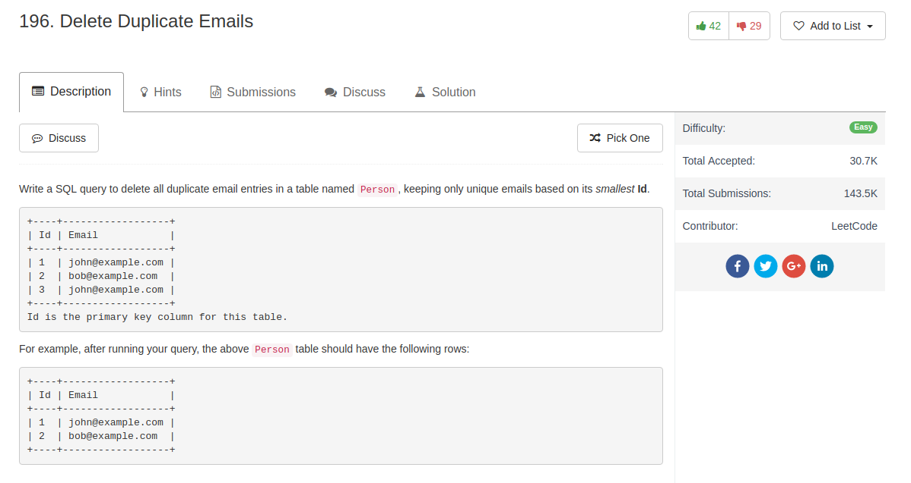

## Comment

- For some reasons I think this question requires `DELETE`; other solutions seem not work.

## Code

```sql
DELETE p1 FROM Person p1,
    Person p2
WHERE
    p1.Email = p2.Email AND p1.Id > p2.Id
```
