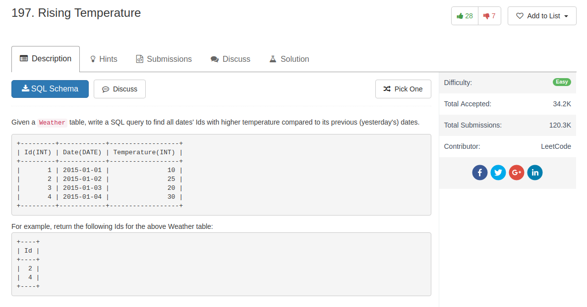

## Comment

- `join` return rows that satisfy all conditions in both tables
- `left join` is outer join, return all rows in the first table
- `DATEDIFF()` function calculate date difference

## Code

```sql
select w1.Id as Id
from Weather w1
join Weather w2
on DATEDIFF(w1.Date, w2.Date) = 1 and w1.Temperature > w2.Temperature
```
