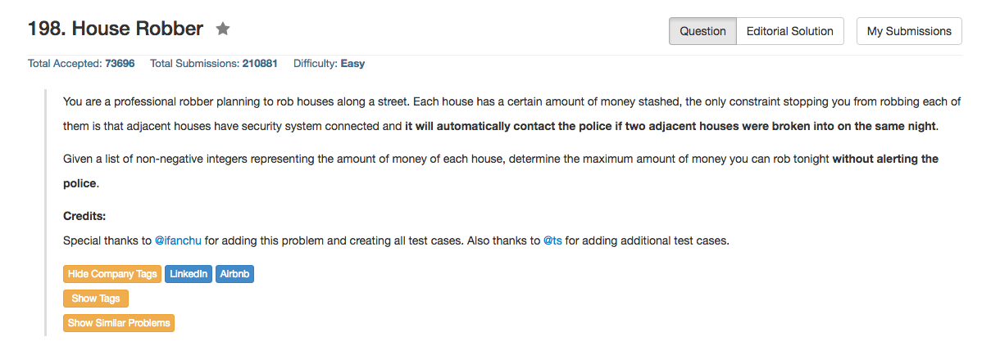

## Algorithm 

- 非常简单的动态规划，虽然我在一开始面试的时候傻逼了想得太复杂
- 思路之一是设`F[i]`为截止到第i个房子可以得到的最大值：`F[i] = max(F[i - 1], F[i - 2] + nums[i])`
    1. 可以不偷当前这个房子，那么`F[i] = F[i - 1]`
    2. 或者偷当前这个房子，那么`i-1`号房子就不能偷了，所以`F[i] = F[i - 2] + nums[i]`
    3. 两者中取最大值
    4. 由于`i - 2`之前的状态都不需要保留，所以直接可以无视。
- 思路之二，来自[这里](https://leetcode.com/discuss/30079/c-1ms-o-1-space-very-simple-solution)，的思路是一样的，但是把整个房子编号分为奇数和偶数来看待，用两个变量(a和b)来分别记录奇数号房子和偶数号房子的结果。根据`i % 2`的结果来分别更新状态如下
    1. `a = max(a + num[i], b)`
    2. `b = max(b + num[i], a)`
    3. 这个程序就非常优美了，见下。

## Comment

- 当年在Bloomberg第一次面试的时候就是做的这道题目。
- 我的思路一的边界条件要注意，尤其是整个输入是空集的时候。当然，我觉得可以问面试官要不要考虑空集情况，以及空集的时候结果是什么。
    
## Code

思路一的实现方法

```c++
class Solution {
public:
    int rob(vector<int>& nums) {
        if (nums.size() == 0) return 0;
        if (nums.size() == 1) return nums[0];
        int twoEarly = 0, oneEarly = nums[0], current;
        for (int i = 1; i < nums.size(); i++){
            current = max(twoEarly + nums[i], oneEarly);
            twoEarly = oneEarly;
            oneEarly = current;
        }
        return current;
    }
};
```

思路二的实现方法，非常优美，来自[这里](https://leetcode.com/discuss/30079/c-1ms-o-1-space-very-simple-solution)，值得学习

```c
#define max(a, b) ((a)>(b)?(a):(b)) //c中这么定义宏也是值得学习的
int rob(int num[], int n) {
    int a = 0;
    int b = 0;

    for (int i=0; i<n; i++)
    {
        if (i%2==0)
        {
            a = max(a+num[i], b);
        }
        else
        {
            b = max(a, b+num[i]);
        }
    }

    return max(a, b);
}
```