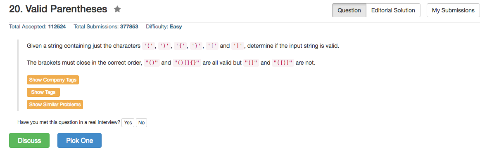

## Algorithm 

- 经典栈问题

## Comment

- 用python好像写的更加紧凑一点。
- 用C写的版本直接把原始数组当做栈来加工了，而且用了一个hack: `s[i] - s[j] < 3`，这里是因为每一对括号的字符距离不超过2，但是不同括号之间的字符距离很大。

<pre>
CHAR:  (  )  [  ]  {   }
NUM:  40 41 91 93 123 125   
</pre>

## Code

```c
bool isValid(char* s) {
    int i, j;
    for (i = 0, j = -1; i < strlen(s); i++){
        if (s[i] == '[' || s[i] == '(' || s[i] == '{') s[++j] = s[i];
        if (s[i] == ']' || s[i] == ')' || s[i] == '}') 
            if (j >= 0 && s[i] - s[j] < 3)
                j--;
            else
                return false;
    }
    return j<0;
}
```
<hr>

```python
class Solution(object):
    def isValid(self, s):
        """
        :type s: str
        :rtype: bool
        """
        stack = [];
        dist = {'[':1,']':-1,'(':2,')':-2,'{':3,'}':-3};
        for char in s:
            if char in ('[','(','{'):
                stack.append(dist[char])
            if char in (']',')','}'):
                if (len(stack) > 0) and (stack[len(stack) - 1] + dist[char] == 0):
                    stack.pop();
                else:
                    return False;
        return len(stack) == 0;
```