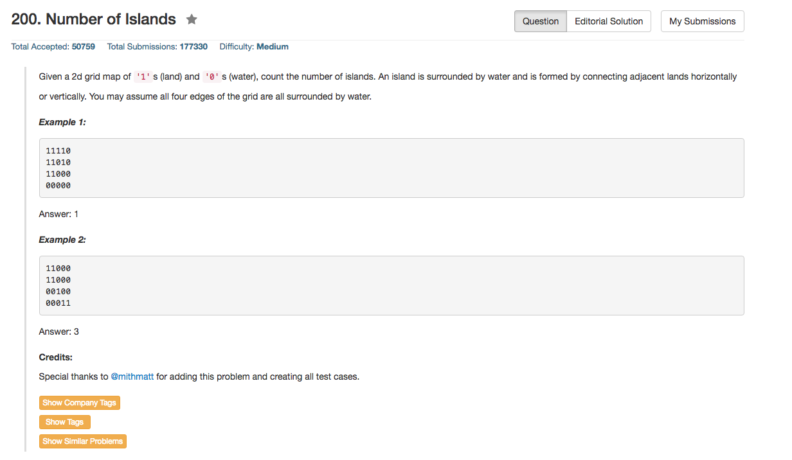

## Algorithm 

- 这个题目也比较直接，就是从一个为'1'的地方出发，然后开始DFS或者BFS到不能为止，然后继续找，如果找到另外一个`1`，那么是另外一个连通子图，继续DFS或者BFS。
- 由于DFS写起来更简洁，所以我就写了DFS。
- BFS的话需要用Queue，其实也应该不难写。

## Comment

- 边界！空集！
- 还有，数组是[0 .. n-1]！这些东西都要注意！

## Code

```C++
class Solution {
public:
    int numIslands(vector<vector<char>>& grid) {
        queue<pair<int,int>> bfs;
        if (grid.size() == 0) return 0;
        int n = grid.size(), m = grid[0].size(), count = 0;
        for (int i = 0; i < n; i++){
            for (int j = 0; j < m; j++){
                if (grid[i][j] == '1'){
                    count++;
                    travel(grid, n, m, i, j);
                }
            }
        }
        return count;
    }
private:
    void travel(vector<vector<char>>& grid, int n, int m, int i, int j){
        if (i >= 0 && i < n && j >= 0 && j < m && grid[i][j] == '1'){
            grid[i][j] = '.';
            travel(grid, n, m, i - 1, j);
            travel(grid, n, m, i, j - 1);
            travel(grid, n, m, i + 1, j);
            travel(grid, n, m, i, j + 1);
        }
    }
};
```
