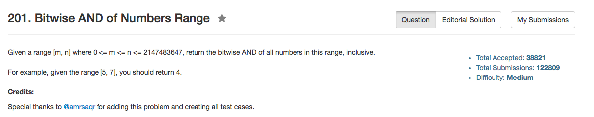

## Algorithm 

- 这道题目其实也不是很难，这里提供我的算法和一个一行的算法
- 我的算法的想法是从低位往高位判断，如果某一位上`n[k] == 1`，那么看`n - 1 > m`是否成立。如果判断成立的话，那么说明存在`n`和`(n - 1)`都会在范围里面。这样的话，小于等于`k`的所有位置都应该是0。因此，`n = n - 1 << k`。
    - 比如`n = 110`和`n - 1 = 101`如果都在范围之内，那么两个数AND之后，就一定是`100`，这相当于`n = n - 1 << 2`
- 另外的一个一行的结果，跟我的基本思路一样，但是程序写的优美很多，来自[这里](https://discuss.leetcode.com/topic/13508/one-line-c-solution/7)
    - 基本思路如原解给出：如果n > m，那么最低位的bit一定为0，所以可以直接看(n/2, m/2)这个范围的结果，然后把这个结果最低位补一个0得到原始的(n,m)范围的结果。

## Comment

- 果然是没有最简单，只有更简单的程序啊

## Code

```C++
class Solution {
public:
    int rangeBitwiseAnd(int m, int n) {
        int k = 0;
        while (n > m){
            if ((n & (1 << k)) && n - 1 >= m){
                n -= 1<< k;
            };
            k++;
        }
        return n;
    }
};
```

来自[这里](https://discuss.leetcode.com/topic/13508/one-line-c-solution)的一行程序

```C++
int rangeBitwiseAnd(int m, int n) {
    return (n > m) ? (rangeBitwiseAnd(m/2, n/2) << 1) : m;
}
```

