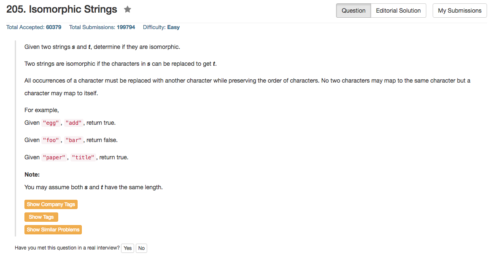

## Algorithm 

- 本质上就是用HashMap看两个字符串的映射是不是一一对应的。
- 但是HashMap有不同的实现方法
    - 一种是我最开始的方法——记录字符映射关系：看`hashS[s[i]] == t[i] && hashT[t[i]] == s[i]`。这种情况就需要两个Hash Map来记录对应的字符映射关系
    - 另一种方法——记录字符映射位置：看`hashS[s[i]]`和`hashT[t[i]]`在各自的字符串第一次出现的位置是不是一样，如果不一样就说明有映射问题，这种方法写的程序更加简洁。

## Comment

- 这道题目因为是字符串，所以不需要用`std::unordered_map<char char>`，而是直接用两个`char hashT[256] = {0}, hashS[256] = {0};`的数组就好了。

## Code

我的版本，也就是解法1：

```c++
class Solution {
public:
    bool isIsomorphic(string s, string t) {
        char hashTableS[256] = {}, hashTableT[256] = {};
        for (int i = 0; i < s.size(); i++){
            if (hashTableS[s[i]] == 0 && hashTableT[t[i]] == 0){
                hashTableS[s[i]] = t[i];
                hashTableT[t[i]] = s[i];
            } else if (hashTableS[s[i]] && hashTableT[t[i]]){
                if (hashTableS[s[i]] != t[i] || hashTableT[t[i]] != s[i]){
                    return false;
                }
            } else {
                return false;
            }
        }
        return true;
    }
};
```

以下这个版本，写得更加优美，我摘录自[这里](https://leetcode.com/discuss/33854/my-6-lines-solution)

```c++
class Solution {
public:
    bool isIsomorphic(string s, string t) {
        int m1[256] = {0}, m2[256] = {0}, n = s.size();
        for (int i = 0; i < n; ++i) {
            if (m1[s[i]] != m2[t[i]]) return false;
            m1[s[i]] = i + 1;
            m2[t[i]] = i + 1;
        }
        return true;
    }
};
```