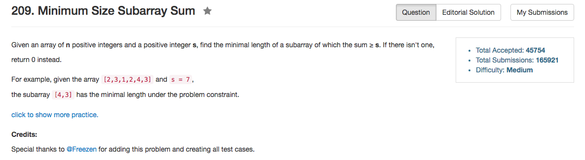

## Algorithm 

- 这道题目有至少有两种算法。
- 第一种可以叫做**二分答案法**，就是直接寻找可能的长度，然后看在该长度的条件下是否存在解
    1. 最大可能长度是n
    2. 当长度确定的时候，只需要O(n)的时间扫一遍数组，循环更新，就可以确定是否存在合法解了。
    3. 这个思路其实还是很具有一般性的
- 第二种使用two pointer
    1. 用`Fast`指针一直往前走，走到第一个位置使得`sum >= s`的时候停下来。
    2. 用`Slow`指针接着走，走到一个位置使得`sum < s`的时候停下来。
    3. 这个时候`fast - slow + 1`这个长度就是当前的最小长度。如果这个长度比全局最优小，就更新全局最优。

## Comment

- 我一开始都没有想到O(NlogN)的算法，不过其实O(NlogN)的算法具有很好的一般性。
- 看起来我这个C++的程序写得还是比较优的。
- `maxLength = min(maxLength, fast - slow + 1);`这个位置至关重要，一开始放到了两个`while`循环中间，完全不能得到正确解。但是后来算法想清楚了以后还是OK的。

## Code

```C++
class Solution {
public:
    int minSubArrayLen(int s, vector<int>& nums) {
        int slow = 0, fast = 0, n = nums.size(), sum = 0, maxLength = n + 1;
        while (fast < n){
            while (fast < n && sum < s) sum += nums[fast++];
            while (slow < fast && sum >= s) sum -= nums[slow++];
            maxLength = min(maxLength, fast - slow + 1);
        }
        return maxLength == n + 1 ? 0 : maxLength;
    }
};
```
