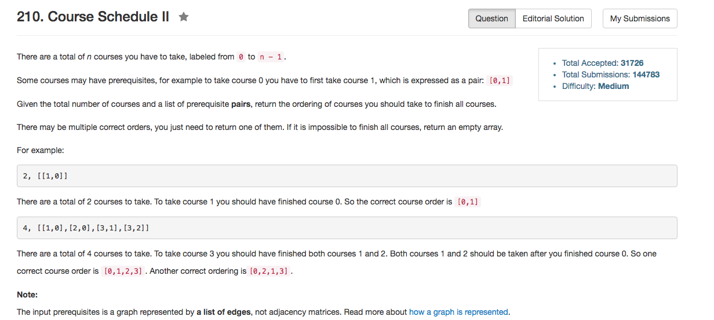

## Algorithm 

- 这道题目就是拓扑排序（toposort），我是用BFS做的，也可以用DFS做。
- 简单的思路就是找入度为0的结点：
    1. 如果入度为0，入队；
    2. 队首出队，放入答案序列；把所有队首结点指向的结点的入度减一，转到1.
    3. 整个队列为空为止。
    4. 如果答案序列长度是`numCourses`那么长，那就得到了一个有效的解；否则返回空串。

## Comment

- STL还是很好用的，虽然我觉得我的空间复杂度有点高。
- 有环的时候判断结果这个需要注意，一开始大意了。

## Code

我的code，写得比较长，用的BFS，但是在我看到的C++的解里面算短的了。

```C++
class Solution {
public:
    vector<int> findOrder(int numCourses, vector<pair<int, int>>& prerequisites) {
        vector<vector<int>> AdjList(numCourses, vector<int>());
        vector<int> degree(numCourses, 0), ans;
        queue<int> BFS;
        for (auto pre : prerequisites) {
            AdjList[pre.second].push_back(pre.first);
            degree[pre.first]++;
        }
        for (int i = 0; i < numCourses; i++){
            if (degree[i] == 0) BFS.push(i);
        }
        while (BFS.size()){
            int node = BFS.front();
            BFS.pop();
            for (auto adj : AdjList[node]) {
                degree[adj]--;
                if (degree[adj] == 0) BFS.push(adj);
            }
            ans.push_back(node);
        }
        return ans.size() == numCourses ? ans : vector<int>();
    }
};
```
