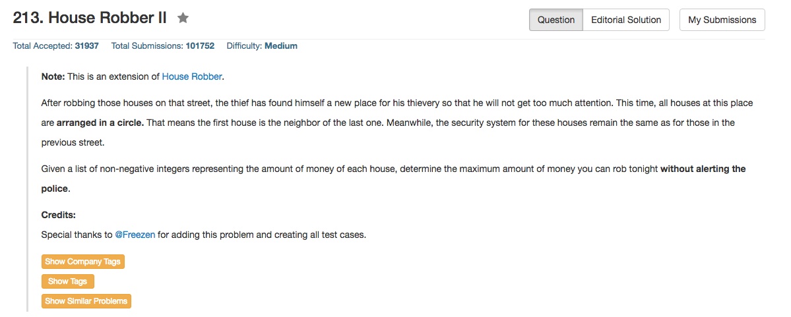

## Algorithm 

- 这个题目没什么好说的，跟House Robber本质上是一样的。
- 唯一的区别是这里有环，那么最容易的方法就是
    1. 假设最后一个house不存在，最优解s1
    2. 假设第一个house不存在，最优解s2
    3. 返回max(s1, s2)
    4. 这是因为这样一定不会出现前后两个房子都被抢，但是又是最优解。
- 当然要注意边界条件，只有一个元素的时候，直接返回这一个元素。

## Comment

- Bloomberg的面试题，秒解，就没有要我写程序了。
- 这个题目如果在House Robber之后提问，其实很简单。

## Code

```C++
class Solution {
public:
    int sumNumbers(TreeNode* root) {
        if (root) {
            pathSum = pathSum * 10 + root->val;
            if (root->left == NULL & root->right == NULL){
                allSum = allSum + pathSum;
            } else {
                sumNumbers(root->left);
                sumNumbers(root->right);
            }
            pathSum = pathSum / 10;
        }
        return allSum;
    }
private:
    int allSum = 0, pathSum = 0;
};
```

